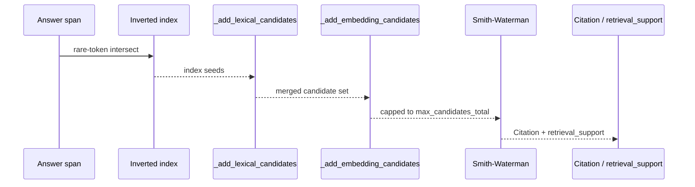

# Performance Tuning

Cite-Right's 0.4.0 pipeline is index-first: an inverted index plus rare-token intersect chooses which source windows are worth aligning, then Smith-Waterman localizes the citation on those hits (plus any optional embedding extras). That choice is the single biggest reason `align_citations` is faster in 0.4.0 than in 0.3.x. This page covers the cost model, the configuration levers that actually move steady-state latency, the reuse patterns that matter for high-volume workloads, and how to read the per-span metrics the library can emit.

## The Cost Model

A citation run has four measurable stages. Knowing which one dominates in your workload is the first step to tuning it.

Tokenization is linear in text length. The default `SimpleTokenizer` makes a single pass over the input, applying Unicode NFKC normalization and case-folding. A 10,000-word document is roughly 10× the tokenization cost of a 1,000-word document, but the absolute time is small compared to the rest of the pipeline.

Passage windowing is linear in document length and window configuration. Each window is a candidate in the inverted index, and `window_size_sentences` / `window_stride_sentences` directly control how many postings the index holds. Smaller strides mean more windows; larger strides mean fewer. Default is one-sentence windows with stride one.

Candidate selection is index-first. Prepare builds an inverted index over the source windows, and per answer span the pipeline runs a rare-token intersect against that index. Smith-Waterman does not run on every window, and it does not run on every answer-span × window pair. The cap is `max_candidates_lexical` (default 200). When an embedder is set, `_add_embedding_candidates` may add more windows from semantic recall, capped by `max_candidates_embedding` (default 200) and `max_candidates_total` (default 400).

Smith-Waterman alignment is quadratic in the length of the two sequences being aligned, and it still localizes the citation. The number of Smith-Waterman runs per answer span tracks the candidate count from the previous step, not the total window count. That is the property that makes index-first faster than the older "align every span against every window" approach.

On the 50-case pack with no embedder, 0.4.0 p50 wall time is about 12.4ms versus about 175.8ms in 0.3.1, roughly 14×. spp is 81.3% versus 83.4%. RAGTruth test quality on 2,675 answers matched 0.3.1. Rust prepare still runs when an embedder is set. Embedder encoding is extra cost on top of the no-embedder numbers above.



## Configuration Levers

Every cost knob in the pipeline lives on `CitationConfig` (`src/cite_right/core/citation_config.py`). The defaults are tuned for balanced recall and quality; if your workload is throughput-bound or quality-bound, these are the levers to reach for first.

### Cap The Candidate Pool

The three `max_candidates_*` fields bound how many windows reach Smith-Waterman. Lower caps mean fewer alignments, faster spans, and a higher chance of dropping a real match that the index found.

```python
from cite_right import CitationConfig, align_citations

config = CitationConfig(
    max_candidates_lexical=100,   # default 200
    max_candidates_embedding=50,  # default 200 (when using an embedder)
    max_candidates_total=150,     # default 400
)
results = align_citations(answer, sources, config=config)
```

`max_candidates_lexical` is the cap on inverted-index seeds. `max_candidates_embedding` is the cap on the top-k that the embedder path can add on top of the seeds. `max_candidates_total` caps the merged set after both feeds are combined. The candidates that survive are ranked by `max(embedding_score, lexical_score)` before Smith-Waterman runs.

For paraphrase-heavy content where the lexical index returns nothing on most spans, the index falls back to the older lexical prefilter and `max_candidates_lexical` is still the cap. The two paths share the same downstream cap.

### Smaller Windows

Each window is a candidate in the inverted index. Smaller, non-overlapping windows produce fewer postings and shorter Smith-Waterman runs at alignment time.

```python
config = CitationConfig(
    window_size_sentences=2,   # default 1
    window_stride_sentences=2, # default 1
)
```

Stride equal to window size makes windows non-overlapping. Stride less than window size makes windows overlap; recall is higher because a sentence appears in more windows, but the index is larger and Smith-Waterman runs more often. Use a non-overlapping window for throughput; use overlapping windows when you cannot afford to miss a cross-sentence match.

### The `fast` Preset

For workloads where latency dominates, `CitationConfig.fast()` bundles the cap reductions in one call.

```python
config = CitationConfig.fast()
```

`fast()` sets `top_k=1`, `max_candidates_lexical=50`, `max_candidates_embedding=50`, `max_candidates_total=100`, `max_citations_per_source=1`, and `max_retrieval_support=1`. Window sizes and alignment scoring stay at the defaults. The result is fewer alignments per span and a single best citation. The throughput-oriented `fast` preset is not a recall preset; do not use it for fact-checking or paraphrase-heavy work.

For the full preset comparison, see [Configuration Presets](../configuration/presets.md). For every field on `CitationConfig` and `CitationWeights`, see [Citation Config](../configuration/citation-config.md).

## Reuse The Prepared Corpus

The single largest latency win on workloads that run the same sources against many answers is `PreparedCitationCorpus`. The first call runs prepare once; every subsequent call reuses the inverted index, IDF weights, passage windows, and optional embedding index.

```python
from cite_right import CitationConfig, PreparedCitationCorpus, SourceDocument, align_citations

sources = [
    SourceDocument(
        id="annual_report",
        text="Acme Corporation reported revenue of 5.2 billion dollars in 2024, representing a 12% increase over the previous year.",
    )
]

# First call: runs prepare, builds inverted index, computes IDF.
corpus = PreparedCitationCorpus.from_sources(
    sources, config=CitationConfig(top_k=3)
)

# Subsequent calls: reuses the prepared state. No re-tokenization, no re-indexing.
for answer in workload:
    results = corpus.align(answer)
```

`PreparedCitationCorpus.from_sources` runs the Rust prepare path when `SimpleTokenizer` and `SimpleSegmenter` are in use and `cite_right._core` is importable. The inverted index, IDF, and passages are then built in Rust. The Python fallback path is taken when the Rust extension is missing or a custom tokenizer / segmenter is supplied. With an embedder set, Rust prepare still runs and the embedding index is built on the prepared candidates; the 0.3.x skip on the embedder path is gone.

`corpus.embedding_build_time_ms` is exposed on the prepared corpus. `align_citations` adds that to the per-answer `embedding_time_ms` when the optional `on_metrics` callback is supplied.

```python
metrics_log = []

def collect(metrics):
    metrics_log.append(metrics)

for answer in workload:
    results = corpus.align(answer, on_metrics=collect)

print(metrics_log[-1])
# AlignmentMetrics(total_time_ms=..., num_answer_spans=..., num_candidates=..., num_alignments=..., embedding_time_ms=..., alignment_time_ms=...)
```

`AlignmentMetrics` is defined in `src/cite_right/core/prepared_corpus.py`. `total_time_ms` is the wall time of the `align` call; `num_alignments` is the count of Smith-Waterman runs the call actually performed; `embedding_time_ms` and `alignment_time_ms` split the per-span timing inside the call.

## Pick The Backend

`align_citations` takes a `backend` argument with three values: `"auto"` (default), `"python"`, and `"rust"`. `"auto"` uses the Rust extension when it is importable, and falls back to pure Python otherwise. The Rust extension reimplements prepare, inverted-index retrieval, and Smith-Waterman alignment. It must match Python outputs; tests fail otherwise.

```python
from cite_right import align_citations

# Default: Rust if available, else Python.
results = align_citations(answer, sources, backend="auto")

# Force pure Python (for debugging, or for the Python fallback path).
results = align_citations(answer, sources, backend="python")

# Require Rust (raises ImportError if the extension is missing).
results = align_citations(answer, sources, backend="rust")
```

Rust alignment releases the GIL during the hot path, so multiple Python threads can call `align_citations` concurrently and use multiple cores. The pure-Python alignment is GIL-bound, so Python threads overlap but do not parallelize that hot path. For details on what the extension does, see [Rust Acceleration](./rust-acceleration.md).

## Threading And Multiprocessing

`align_citations` is thread-safe; multiple threads can call it on the same `PreparedCitationCorpus` instance. The Rust extension releases the GIL during alignment, so a thread pool of N workers can use N cores at once.

```python
from concurrent.futures import ThreadPoolExecutor
from cite_right import PreparedCitationCorpus

corpus = PreparedCitationCorpus.from_sources(sources)

def align(answer):
    return corpus.align(answer)

with ThreadPoolExecutor(max_workers=8) as pool:
    results = list(pool.map(align, answer_workload))
```

For pure-Python workloads, threads overlap I/O and embedding encoding but the alignment is GIL-bound. Use `multiprocessing` if the workload is large enough that the per-process interpreter startup is cheaper than running on a single core.

```python
from multiprocessing import Pool
from cite_right import align_citations

def align_worker(args):
    answer, sources = args
    return align_citations(answer, sources)

with Pool(processes=8) as pool:
    results = pool.map(align_worker, workload)
```

Each worker process re-runs prepare the first time it sees a source set. To avoid that, pass a `PreparedCitationCorpus` pickled into the worker, or run prepare on a per-process basis once and reuse the corpus for many answers inside the worker.

## Memory

The inverted index, IDF dictionary, and `Candidate.token_ids` are the main per-document memory costs. For very long corpora, pre-chunk documents into `SourceChunk` objects with bounded character length so that each `PreparedCitationCorpus` carries only a slice of the source side.

```python
from cite_right import SourceChunk

chunks = [
    SourceChunk(
        source_id="annual_report",
        source_index=0,
        text=block,
        doc_char_start=start,
        doc_char_end=start + len(block),
        document_text=full_text,
    )
    for block, start in blocks_with_offsets
]
```

`SourceChunk` rebases offsets onto `document_text` so that `source.full_text[citation.char_start:citation.char_end] == citation.evidence` still holds for citations inside the chunk. The tokenization and indexing pass runs only over `text`, not the full document. For pre-chunking patterns and the rebasing contract, see [How It Works](../concepts/how-it-works.md).

The alignment matrix in Smith-Waterman is the main per-hit memory cost. With the default one-sentence windows, each matrix is small. Index-first retrieval caps how many of those matrices the pipeline ever builds.

## What The Per-Span Metrics Tell You

`align_citations(answer, sources, on_metrics=callback)` calls the callback once with an `AlignmentMetrics` after each `align` call. The fields are diagnostic, not contractual:

- `total_time_ms` is the wall time of the `align` call, including answer segmentation and the per-span loop.
- `num_answer_spans` is how many spans the answer produced. If this is much higher than the sentence count, the segmenter is splitting aggressively.
- `num_candidates` is the size of the merged candidate set. With an embedder, this includes both lexical seeds and embedding extras.
- `num_alignments` is the number of Smith-Waterman runs the call performed. If this equals `num_candidates`, the index did not filter. If it is much smaller, the candidate caps did.
- `alignment_time_ms` is time inside the per-span loop excluding embedding time.
- `embedding_time_ms` is the time spent encoding answer spans (and, for the first call through `align_citations`, building the source-side embedding index).

When `num_alignments` is large and `total_time_ms` is dominated by `alignment_time_ms`, the index is letting too many candidates through; lower `max_candidates_lexical` or `max_candidates_total`. When `total_time_ms` is dominated by `embedding_time_ms`, the embedder is the bottleneck; consider a smaller model, a coarser `min_embedding_similarity`, or a smaller `max_candidates_embedding`.

## Profile A Single Call

For a quick breakdown of one call, time the call yourself and print the corpus-side metrics.

```python
import time
from cite_right import CitationConfig, PreparedCitationCorpus, align_citations

sources = [SourceDocument(id=str(i), text=...) for i in range(num_sources)]
corpus = PreparedCitationCorpus.from_sources(sources, config=CitationConfig(top_k=3))

metrics_log = []
def collect(m):
    metrics_log.append(m)

start = time.perf_counter()
results = corpus.align(answer, on_metrics=collect)
elapsed_ms = (time.perf_counter() - start) * 1000

last = metrics_log[-1]
print(f"wall: {elapsed_ms:.2f} ms")
print(f"alignment_time: {last.alignment_time_ms:.2f} ms")
print(f"embedding_time: {last.embedding_time_ms:.2f} ms")
print(f"spans: {last.num_answer_spans} candidates: {last.num_candidates} alignments: {last.num_alignments}")
print(f"corpus.embedding_build_time_ms: {corpus.embedding_build_time_ms:.2f} ms (one-time on first call)")
```

For memory, `tracemalloc` reports Python heap usage; the Rust extension allocates outside Python's heap, so system-level tools (for example `/usr/bin/time -v`, `ps`, or a Rust-aware profiler) are needed to see the full picture on the hot path. The [Rust Acceleration](./rust-acceleration.md) page covers when each side matters.

## When To Reach For Embeddings

An embedder is not a default-on performance lever. The first call encodes every source passage and the answer spans, which is a one-time cost paid at corpus build. Steady-state per-answer cost adds the answer-span encoding and the top-k lookup against the embedding index. For most no-paraphrase workloads the inverted index alone finds the right window, and the embedder only adds the cost of running similarity on the whole corpus without changing the answer.

Enable an embedder when the lexical index returns nothing on spans that a human reader would expect to be cited, when the domain has stable synonyms, or when the corpus is long enough that first-pass recall drops. Disable it when the content is near-verbatim, when sources are short single sentences, or when the embedder is the dominant per-answer cost and the index alone is good enough. For the full set of trade-offs, see [Embedding Retrieval](./embedding-retrieval.md).

## Background Reading

- [How It Works](../concepts/how-it-works.md) — the index-first pipeline end to end.
- [Rust Acceleration](./rust-acceleration.md) — what the `cite_right._core` extension does and when the Python fallback path is used.
- [Embedding Retrieval](./embedding-retrieval.md) — when to add semantic recall on top of the lexical index.
- [Citation Config](../configuration/citation-config.md) — every field on `CitationConfig` and `CitationWeights`.
- [Configuration Presets](../configuration/presets.md) — the `balanced`, `strict`, `permissive`, and `fast` preset trade-offs.
