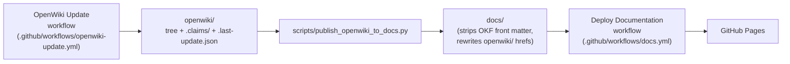

# openwiki/

This directory is the generated documentation tree for coding agents, produced by [OpenWiki](https://docs.langchain.com/oss/openwiki/overview) 0.4.0. GitHub Pages publishes from `docs/` using the existing `mkdocs.yml` nav, not from `openwiki/` directly. This directory is not a Wiki tab and there is no `/wiki/` URL.

## Tree Layout

The tree under `openwiki/` is split between a public subtree that ships to GitHub Pages and an agent-only subtree that stays inside the repository.

- **Public pages.** Sixteen pages plus the auto-generated Home at `openwiki/index.md`. Their paths match `mkdocs.yml` exactly: `index.md`, `getting-started/`, `concepts/`, `configuration/`, `integrations/`, `advanced/`. These are the only pages copied into `docs/`.
- **Agent-only pages.** Two pages under `openwiki/testing/` (`pytest-markers.md`, `contract-tests.md`) plus this reference page (`README.md`) and `openwiki/quickstart.md`. They are denser, may mention `openwiki/` paths and source-file paths, and never reach the public site.

The full list of public paths that get copied is hard-coded in `scripts/publish_openwiki_to_docs.py` as `PUBLIC_PATHS`. Anything outside that list is agent-only by construction.

## INSTRUCTIONS.md Is The User Brief

`openwiki/INSTRUCTIONS.md` is the user-authored brief. OpenWiki reads it on every run as the source of truth for page paths, invariants, voice rules, and the allowed measured numbers. The brief itself must not be regenerated: it is excluded from publishing (`SKIP_NAMES` in `scripts/publish_openwiki_to_docs.py`) and the brief explicitly tells OpenWiki not to overwrite it on `--init` or `--update`. To change page paths, voice rules, or the invariants list, edit `openwiki/INSTRUCTIONS.md`, never the generated pages.

## How Pages Flow Into docs/

The flow from a GitHub Actions run to a deployed site has three steps.

1. **Generate.** The `OpenWiki Update` workflow (`.github/workflows/openwiki-update.yml`) installs the `openwiki` CLI and runs `bash scripts/openwiki_update.sh` on push to `main`, on `workflow_dispatch`, and on a daily 08:00 UTC cron. It needs the repository secret `OPENROUTER_API_KEY`. Generated pages, Grounded Claims under `.claims/`, and `.last-update.json` only appear after this step succeeds.
2. **Publish.** On the same job, `python3 scripts/publish_openwiki_to_docs.py` copies the public paths from `openwiki/` into `docs/`. The script strips OKF YAML front matter, rewrites any `openwiki/` hrefs into MkDocs-relative paths, and leaves `docs/api/`, `docs/assets/`, and stylesheets alone. Agent-only trees (`.claims/`, `testing/`, `api/`, `assets/`, `stylesheets/`) and `INSTRUCTIONS.md`, `.last-update.json`, `README.md` are excluded via `SKIP_DIR_PREFIXES` and `SKIP_NAMES`. OKF `# Files` / `# Directories` directory listings are also skipped.
3. **Deploy.** The `Deploy Documentation` workflow (`.github/workflows/docs.yml`) builds with `mkdocs build --strict` on push to `main` under `docs/**`, `mkdocs.yml`, or its own path, then uploads the `site/` artifact to GitHub Pages.

Generated files are never pushed straight to `main`. The update workflow opens a pull request on the `openwiki/update` branch via `peter-evans/create-pull-request` with paths `openwiki`, `docs`, `AGENTS.md`, and `CLAUDE.md`. Branch protection on `main` is what makes that PR the merge gate.

## What The Publish Script Does

`scripts/publish_openwiki_to_docs.py` is the bridge between the two trees. Reading it is the fastest way to verify what gets copied.

- `PUBLIC_PATHS` lists the eighteen public files exactly as they appear under `mkdocs.yml` `nav`.
- `SKIP_DIR_PREFIXES` is `(".claims/", "testing/", "api/", "assets/", "stylesheets/")`. Any `openwiki/` source under those prefixes is never copied.
- `SKIP_NAMES` is `{"INSTRUCTIONS.md", ".last-update.json", "README.md"}`. The filename match is exact and also applied to `Path(rel).name`, so an `openwiki/README.md` at the tree root is protected.
- `strip_front_matter` removes a leading `---` block so readers do not see OKF YAML.
<!-- openwiki: broken internal link [href] file "href" does not exist. Fix the href or restore the target, then delete this comment. -->
- `rewrite_links` rewrites `[text](href)` and HTML `href=` URLs that point at `openwiki/...` (with prefixes `/openwiki/`, `openwiki/`, `./openwiki/`, `../openwiki/`) into MkDocs-relative paths from the destination directory. Targets `openwiki/` and `openwiki` itself resolve to `index.md`.
- `is_okf_directory_listing` recognises the OpenWiki auto-generated index pages whose first heading is `# Files` (or whose headings include both `files` and `directories`) and skips them, so `openwiki/index.md` is intentionally not copied to `docs/` even though it sits at the public route — that Home is owned by the public tree directly under `docs/`.

The CLI accepts `--openwiki <path>` and `--docs <path>` for local runs; both default to `<repo>/openwiki` and `<repo>/docs`. It exits non-zero if either root is missing.

## CI Model Rotation

The update workflow does not pin a paid model. `scripts/openwiki_pick_model.py` lists OpenRouter `:free` model ids, preferring tool-calling support, then the Artificial Analysis `coding_index` when present, else `context_length`, then `created`. `scripts/openwiki_update.sh` exports the chosen id as `OPENWIKI_MODEL_ID` and retries the next candidate on `429`/`402`/rate-limit, `403`/`404`, agentic-harness blocks, and model-unavailable errors. A `429` sleeps `retry_after_seconds` (or until `X-RateLimit-Reset`, capped at 90s) before moving on. The current `.last-update.json` records which model produced the last run.

## Entry Points For Coding Agents

Once pages exist, start there instead of rediscovering the tree.

- **Reader / public questions.** `openwiki/index.md` (Home) and the sixteen public pages indexed in `openwiki/quickstart.md`.
- **Pipeline work.** `openwiki/concepts/how-it-works.md` for segment, prepare, tokenize, index-first selection, Smith-Waterman, ranking, contradiction, status. Point at `src/cite_right/citations.py`.
- **Prepare, inverted index, IDF.** `src/cite_right/core/prepared_corpus.py` is the Python entry; the Rust extension lives in `rust_core/` and is reachable through `src/cite_right/_core.pyi`.
- **Rust parity work.** `openwiki/testing/contract-tests.md` and `tests/test_alignment_rust_parity.py`.
- **Optional extras.** `openwiki/testing/pytest-markers.md` lists the seven markers (`rust`, `spacy`, `embeddings`, `tiktoken`, `huggingface`, `pysbd`, `slow`) registered in `tests/conftest.py`.
- **Voice and invariants.** `openwiki/INSTRUCTIONS.md` is the brief. Edit it; do not regenerate it.
