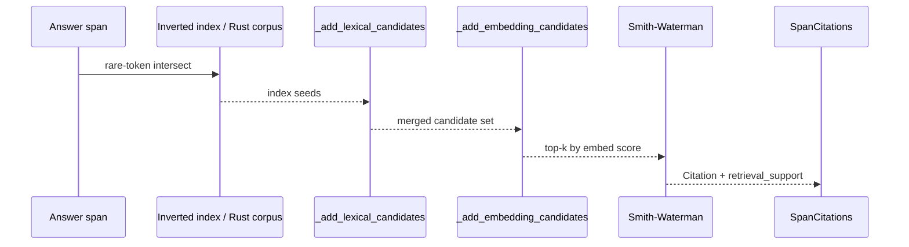

# Embedding Retrieval

By default, Cite-Right uses an inverted index (rare-token intersect) to pick source windows for alignment, then runs Smith-Waterman to localize the exact citation. When source passages are heavily paraphrased or use vocabulary that does not match the answer, the index alone can miss the right window. Embedding retrieval adds a semantic-recall channel on top of the lexical index so those windows are not silently dropped.

## How It Fits The Pipeline

Candidate selection still starts from the index. With an embedder set, `_add_embedding_candidates` then queries an `EmbeddingIndex` of every source passage and may add non-index windows to the candidate set before Smith-Waterman runs. Smith-Waterman still localizes `char_start` / `char_end`. Embeddings change recall, not the contract that every `Citation` has a precise source span.



`retrieval_support` is a separate channel. A passage that the index or embedder selected but Smith-Waterman could not localize is emitted as `RetrievalSupport`, not as a `Citation`, and it never flips `status`. A span with no localized evidence is `"unsupported"` even when the embedder is confident.

## Installation And First Run

Embedding retrieval is an optional extra on top of the default install.

```bash
pip install "cite-right[embeddings]==0.4.0"
```

Then point `align_citations` at an embedder.

```python
from cite_right import SentenceTransformerEmbedder, align_citations

embedder = SentenceTransformerEmbedder("all-MiniLM-L6-v2")
results = align_citations(answer, sources, embedder=embedder)
```

The first call encodes every source passage and the answer spans. `PreparedCitationCorpus.from_sources(..., embedder=embedder)` returns a corpus with `embedding_index` already populated, so the same embedder can be reused across many answers without re-encoding the source side.

## SentenceTransformerEmbedder

`SentenceTransformerEmbedder(model_name)` is a thin wrapper over the `sentence-transformers` library. It exposes the single `encode(texts) -> list[list[float]]` method that the `Embedder` protocol expects, plus an in-process LRU cache keyed on `(text, model_name)` so repeated queries for the same passage do not re-encode.

```python
from cite_right import SentenceTransformerEmbedder

# Fast, good default for English
embedder = SentenceTransformerEmbedder("all-MiniLM-L6-v2")
```

`all-MiniLM-L6-v2` (384 dimensions) is the documented default. Larger models like `all-mpnet-base-v2` (768 dimensions) trade speed for nuance. Model load is one-time per process; allocate the embedder at startup and reuse it.

## Custom Embedders

Anything that implements `Embedder.encode(texts) -> list[list[float]]` plugs in. The protocol is runtime-checkable, so a duck-typed class works.

```python
from typing import Sequence

from cite_right.models.base import Embedder


class HashEmbedder:
    def encode(self, texts: Sequence[str]) -> list[list[float]]:
        return [[hash(t) % 997] for t in texts]
```

Custom embedders are useful for tests (deterministic vectors), for vendor APIs, or for domain-tuned models.

## Reading Retrieval Support

High similarity alone is not a citation. A passage that survived candidate selection but did not localize is exposed on `SpanCitations.retrieval_support`.

```python
for result in results:
    for support in result.retrieval_support:
        print(support.source_id, support.embedding_score, support.lexical_score)
        print(support.passage_text)
```

`retrieval_support` is only emitted when a candidate is selected and has either a positive lexical score or an embedding score at or above `min_embedding_similarity`. Embedding-only extras carry `lexical_score == 0.0`; lexical seeds carry the IDF overlap. This split lets you see at a glance which channel found the passage.

## Configuration

Several `CitationConfig` and `CitationWeights` fields shape the embedder path.

- `min_embedding_similarity` (default `0.3`) is the cosine-similarity threshold for embedding-only `retrieval_support` entries. Anything below it is dropped.
- `max_candidates_embedding` (default `200`) caps the number of extra windows `_add_embedding_candidates` can add.
- `max_candidates_total` (default `400`) caps the merged candidate set after lexical seeds and embedding extras are combined.
- `weights.embedding` (default `0.5`) and `weights.lexical` (default `0.5`) are added into the final citation score, not the candidate-selection step. The page-level pipeline at `../concepts/how-it-works.md` covers that score.
- `CitationConfig.permissive()` lowers `min_embedding_similarity` to `0.25` for paraphrase-heavy content.

```python
from cite_right import CitationConfig, SentenceTransformerEmbedder, align_citations
from cite_right.core.citation_config import CitationWeights

embedder = SentenceTransformerEmbedder("all-MiniLM-L6-v2")
config = CitationConfig(
    max_candidates_lexical=200,
    max_candidates_embedding=100,
    max_candidates_total=250,
    min_embedding_similarity=0.4,
    weights=CitationWeights(lexical=0.3, embedding=0.7),
)
results = align_citations(answer, sources, embedder=embedder, config=config)
```

`CitationConfig.fast()` reduces `max_candidates_embedding` to `50` and pairs it with a small `max_candidates_total` for latency-bound workloads.

## How Candidates Are Combined

`select_candidates` merges three sources in order: inverted-index seeds (or `rust_corpus.query_index` on the default Rust path), lexical prefilter, and the embedding top-k. The first two feed each other because lexical scores are filled only for the index seeds; embedding-only extras keep `lexical_score == 0.0`. Ranking uses `max(embedding_score, lexical_score)`, so a strong embedder hit on a non-seed window can still make the cut.

Once the merged set is in hand, every selected window still goes through Smith-Waterman. A weak Smith-Waterman pass on an embedding-only window can still produce a `Citation` if the same passage also has enough content-word overlap with the answer (the sequential-coverage rule, not paraphrase-only), and otherwise degrades into `retrieval_support` with the embedding score attached.

## Rust Prepare With An Embedder

Rust prepare still runs with an embedder when `SimpleTokenizer` and `SimpleSegmenter` are in use. The embedding index is built on those prepared candidates. The 0.3.x skip of Rust prepare on the embedder path is gone. A custom tokenizer or segmenter takes the Python fallback path, and the embedding index is then built on the Python candidates instead. The public API is unchanged: `align_citations(answer, sources, embedder=...)` and `PreparedCitationCorpus.from_sources(..., embedder=...)`.

## When Embedding Retrieval Helps

- Paraphrased claims where the answer shares meaning with the source but little vocabulary, so the index returns nothing and the span is otherwise `"unsupported"`.
- Domains with stable synonyms (revenue / earnings / sales) where the source uses one term and the answer uses another.
- Long source corpora where recall on the first-pass index drops citations a human reader would expect.

Note that on the 50-case pack with no embedder, 0.4.0 p50 wall time is about 12.4ms versus about 175.8ms in 0.3.1. Embedder encoding is extra cost on top of the no-embedder numbers. Initialize the embedder once per process and pass the same instance into `align_citations` for repeated queries; `PreparedCitationCorpus` will keep the encoded source index for the lifetime of the corpus object.

## When It Is Not Worth It

- Near-verbatim content where index-first already finds the right window.
- Very short passages or single sentences: there is too little context for a stable embedding.
- High-throughput workloads where the embedder is the dominant cost and the index alone is good enough; consider `CitationConfig.fast()` to cap the candidate pool instead.

For background on the index-first default, see [Rust Acceleration](./rust-acceleration.md) and [How It Works](../concepts/how-it-works.md). For tuning knobs, see [Citation Config](../configuration/citation-config.md). For install combinations, see [Installation](../getting-started/installation.md).
