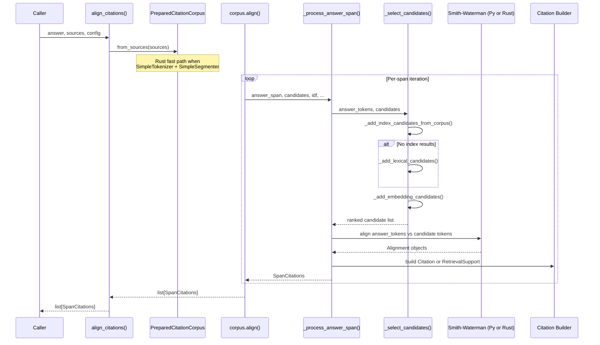

# Citation alignment pipeline

This page documents the end-to-end flow that transforms an answer string plus a set of source documents into ranked `Citation` and `RetrievalSupport` entries. The pipeline operates in two distinct phases: a one-time **preparation** phase that builds a reusable index over the sources, and a per-answer **alignment** phase that finds evidence for each answer segment.

## High-level sequence



*Figure 1: Answer segmentation → candidate selection (index/lexical/embedding) → Smith-Waterman → evidence extraction → status assignment.*

## Phase 1 — Corpus preparation

The `PreparedCitationCorpus` class encapsulates all state needed for repeated alignment against the same source corpus. It is constructed once via `PreparedCitationCorpus.from_sources()`:

1. **Source normalization** — Each input (string, `SourceDocument`, or `SourceChunk`) is wrapped in a `NormalizedSource` that records the document text, identifier, and character-offset base for re-slicing evidence.

2. **Source segmentation and passage generation** — Each source is split into sentences (or other units) by the configured `Segmenter`, then windows of consecutive segments are collected into `Passage` objects. The window size and stride are controlled by `CitationConfig.window_size_sentences` and `CitationConfig.window_stride_sentences`.

3. **Tokenization** — Every passage is tokenized using the configured `Tokenizer`. Each passage yields a list of token IDs and character-span offsets.

4. **Candidate building** — Every passage becomes a `Candidate` with:
   - Global index (unique across all sources)
   - Source reference (id, index, offset base)
   - Passage (character range in source)
   - Token IDs and token-spans for that passage
   - Token frozenset (for fast overlap checks)

5. **IDF computation** — Document frequency is computed across all candidates to weight rare terms higher in lexical scoring.

6. **Optional embedding index** — If an `Embedder` is provided, the system encodes all candidate passages into a vector index for semantic similarity search.

### Rust fast path for preparation

When `SimpleTokenizer` and `SimpleSegmenter` are in use and the Rust extension is available, the preparation phase delegates to `rust_tokenize_and_prepare()` in `rust_core/src/prepare.rs`. This function:

- Tokenizes source texts sequentially with `SimpleTokenizer` (to maintain consistent vocabulary)
- Segments and generates passages in parallel using Rayon
- Builds the inverted index in Rust
- Returns a `PreparedCorpus` object that stays resident in Rust memory

Python receives lightweight `Candidate` objects with empty `token_ids`/`token_spans`; those fields are fetched on-demand from the Rust corpus during alignment. The Rust corpus also stores the vocabulary mapping, which is synced back to the Python `SimpleTokenizer._vocab` so token IDs remain consistent across the Rust/Python boundary.

This Rust path runs even when an embedder is provided — the embedder encoding still happens in Python using the `EmbeddingIndex`.

## Phase 2 — Answer alignment

The `align()` method on `PreparedCitationCorpus` orchestrates per-span processing:

### Answer segmentation

The answer string is split into `AnswerSpan` objects by the configured `AnswerSegmenter`. By default this uses `SimpleAnswerSegmenter`, which splits on sentence boundaries. Each span carries:
- The segment text
- Character offsets in the full answer
- Kind (sentence/clause/paragraph) and positional indices

### Per-span processing

For each answer span, `_process_answer_span()` performs:

1. **Tokenization** — The answer span is tokenized with the same tokenizer used for sources.

2. **Lexical prefilter** — When not using the Rust corpus, IDF-weighted overlap scores are computed between the answer token set and each candidate. This is skipped when the Rust corpus is available; lexical scores are computed on-demand during candidate selection instead.

3. **Candidate selection** — The `_select_candidates()` function selects which candidates will be evaluated by Smith-Waterman. This is the critical index-first / SW-localize flow described below.

4. **Alignment** — The answer token sequence is aligned against each selected candidate's token sequence using Smith-Waterman local alignment.

5. **Citation building** — Each alignment result is evaluated for quality. If it meets the configured thresholds, a `Citation` is built with exact character-offset evidence. If the alignment is weak but the candidate was selected for retrieval support, a `RetrievalSupport` entry is created instead.

6. **Status assignment** — The span status is set to `"supported"`, `"partial"`, or `"unsupported"` based on the best citation's `answer_coverage` relative to `CitationConfig.supported_answer_coverage`.

## Candidate selection — index-first / SW-localize flow

The `_select_candidates()` function (repo://src/cite_right/citations.py#L1180-L1232) implements an ordered, multi-stage candidate selection strategy that balances recall and speed:

```python
def _select_candidates(
    candidates,
    answer_tokens,
    answer_set,
    lexical_scores,
    idf,
    embedding_index,
    inverted_index,
    rust_corpus,
    query_vector,
    cfg,
) -> CandidateSelection:
    selected: dict[int, tuple[float, float]] = {}

    if rust_corpus is not None and HAS_RUST_CORE:
        _add_index_candidates_from_corpus(selected, answer_tokens, rust_corpus, lexical_scores, cfg)
        if not selected:
            _add_lexical_candidates(selected, candidates, lexical_scores, cfg, answer_set, idf, rust_corpus)
        elif not lexical_scores:
            _fill_rust_lexical_scores(lexical_scores, list(selected), rust_corpus, answer_set, idf)
    elif inverted_index is not None and HAS_RUST_CORE:
        _add_index_candidates(selected, answer_tokens, inverted_index, lexical_scores, cfg)
        if not selected:
            _add_lexical_candidates(selected, candidates, lexical_scores, cfg)
    else:
        _add_lexical_candidates(selected, candidates, lexical_scores, cfg)

    _add_embedding_candidates(selected, embedding_index, query_vector, cfg)

    return _rank_selected_candidates(selected, candidates, cfg)
```

The four selection methods are:

| Method | Source | Trigger condition |
|---|---|---|
| `_add_index_candidates_from_corpus()` | Rust `rust_corpus.query_index()` | `rust_corpus` is available (Rust preparation path) |
| `_add_index_candidates()` | Python `InvertedIndex.query()` | Python preparation path with `InvertedIndex` |
| `_add_lexical_candidates()` | IDF-weighted overlap scoring | No index hits, or fallback when index returns nothing |
| `_add_embedding_candidates()` | `EmbeddingIndex.top_k()` | An `Embedder` was provided and `max_candidates_embedding > 0` |

### Index-first ordering

The **index-based candidates are added first**, using a conjunctive (AND) query over the answer tokens. The inverted index ranks candidates by the rarity of shared tokens (inverse document frequency), returning only candidates that contain the rarest query tokens. This dramatically reduces the candidate set before lexical scoring or embedding similarity is evaluated.

If the index returns no candidates (a rare query that matches no passage), the pipeline falls back to computing IDF-weighted lexical overlap scores across all candidates. This ensures recall even for queries with no index hits.

### SW-localize refinement

After candidate selection, Smith-Waterman local alignment localizes the exact evidence substring within each candidate passage. The SW score and match count determine whether the candidate produces a `Citation` (strong alignment) or a `RetrievalSupport` (weak alignment but selected by lexical/embedding signals).

## Alignment backends

The pipeline supports two Smith-Waterman backends:

- **Python** (`SmithWatermanAligner` in `src/cite_right/core/aligner_py.py`): Full traceback implementation in pure Python. Tracks match counts, optional match blocks for multi-span evidence, and query/token start positions.

- **Rust** (`RustSmithWatermanAligner` in `src/cite_right/core/aligner_rust.py`): Delegates to the Rust `_core` extension which implements the same algorithm in Rust with SIMD vectorization. The backend is auto-selected based on availability, or explicitly chosen via the `backend` parameter to `align_citations()`.

Both backends return an `Alignment` object with `score`, `token_start`, `token_end`, `query_start`, `query_end`, `matches`, and optionally `match_blocks` for non-contiguous alignment regions.

## Evidence extraction and scoring

After alignment, each candidate's alignment is evaluated by `_build_exact_citation()` (repo://src/cite_right/citations.py#L680-L725):

1. **Alignment metrics** — Compute `answer_coverage` (fraction of answer tokens matched), `evidence_coverage` (fraction of aligned evidence that matches), and `normalized_alignment` (score divided by theoretical maximum).

2. **Quality gates** — The alignment is discarded if:
   - Score is below `min_alignment_score`
   - Aligned region is empty (`token_start >= token_end`)
   - `answer_coverage` is below `min_answer_coverage` and content-word overlap is also below that threshold
   - `require_all_answer_tokens_in_evidence` is set and not all answer tokens are matched

3. **Final score** — A weighted combination of normalized alignment, answer coverage, evidence coverage, lexical overlap, and embedding similarity. If below `min_final_score`, the citation is rejected.

4. **Character offsets** — The aligned token indices are mapped back to character offsets in the source using the candidate's `token_spans`, then re-sliced from the source document for the evidence string.

## Citation ranking and output

After all candidates are evaluated for a span:

1. **`_rank_and_limit_citations()`** — Citations are sorted by `score`, then limited to `CitationConfig.top_k` globally and `CitationConfig.max_citations_per_source` per source document.

2. **`_rank_retrieval_support()`** — `RetrievalSupport` entries are sorted by retrieval score and limited to `CitationConfig.max_retrieval_support`.

3. **Status assignment** — `_span_status()` (repo://src/cite_right/citations.py#L1610-L1633) determines the span status:
   - `"supported"` if the best citation's `answer_coverage >= supported_answer_coverage`
   - `"partial"` if there is a citation but coverage is below the supported threshold
   - `"unsupported"` if no citations were found

The output is a list of `SpanCitations` objects, one per answer span, each containing the answer segment, the list of `Citation` objects, the list of `RetrievalSupport` entries, and the status string.

## Multi-span evidence

When `CitationConfig.multi_span_evidence` is enabled and an alignment produces disjoint match blocks, the system extracts multiple `EvidenceSpan` objects from a single alignment. Adjacent spans are merged if the gap between them is below `multi_span_merge_gap_chars`. If the merged count exceeds `multi_span_max_spans`, the citation falls back to a single enclosing span for backward compatibility.

## Configuration presets

`CitationConfig` provides class methods for common use cases:

| Preset | Use case | Key differences |
|---|---|---|
| `balanced()` (default) | General purpose | `top_k=3`, moderate thresholds |
| `strict()` | High-precision, fact-checking | `top_k=2`, higher coverage thresholds, `require_all_answer_tokens_in_evidence=True` |
| `permissive()` | Paraphrased or summarized content | `top_k=5`, lower `min_answer_coverage` |
| `fast()` | Large-scale batch processing | `top_k=1`, `max_candidates_total=100` |
