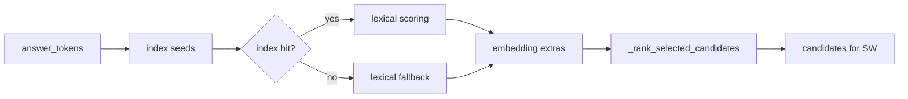

# Candidate retrieval pipeline

This page documents the candidate-selection phase of the citation alignment pipeline: how the system prunes a potentially large corpus into a small ranked set of candidates for Smith-Waterman alignment. The ordering is strict — inverted-index seeds come first, then lexical fallback, then embedding extras — and each stage is independently capped by its own limit.

## Overview

When `PreparedCitationCorpus.align()` processes an answer span, it tokenizes the span, optionally precomputes IDF-weighted lexical scores, and then calls `_select_candidates()` (repo://src/cite_right/citations.py#L1180-L1232). That function produces a `CandidateSelection` — a list of `(candidate_index, embedding_score, lexical_score)` tuples sorted by combined signal strength.



*Figure 1: Candidate selection flow from answer tokens to ranked list.*

## `_select_candidates` ordering

The function follows an explicit ordering (repo://src/cite_right/citations.py#L1193-L1232):

```python
def _select_candidates(..., cfg: CitationConfig) -> CandidateSelection:
    selected: dict[int, tuple[float, float]] = {}  # idx → (embed_score, lexical_score)

    # 1. Rust corpus index query (preferred)
    if rust_corpus is not None and HAS_RUST_CORE:
        _add_index_candidates_from_corpus(selected, answer_tokens, rust_corpus, ...)
        if not selected:
            _add_lexical_candidates(...)        # fallback
        elif not lexical_scores:
            _fill_rust_lexical_scores(...)      # on-demand fill for seeds

    # 2. Python InvertedIndex (when Rust corpus unavailable)
    elif inverted_index is not None and HAS_RUST_CORE:
        _add_index_candidates(selected, answer_tokens, inverted_index, ...)
        if not selected:
            _add_lexical_candidates(...)        # fallback

    # 3. Pure lexical (when no index at all)
    else:
        _add_lexical_candidates(selected, candidates, lexical_scores, cfg)

    # 4. Embedding top-k (always runs last, may add new candidates)
    _add_embedding_candidates(selected, embedding_index, query_vector, cfg)

    return _rank_selected_candidates(selected, candidates, cfg)
```

### Stage 1 — Index seeding (`rust_corpus.query_index`)

When the Rust preparation path was used, the inverted index lives entirely in the Rust `PreparedCorpus` (repo://src/cite_right/core/prepared_corpus.py#L116-L118). `_add_index_candidates_from_corpus()` calls `rust_corpus.query_index(answer_tokens, cfg.max_candidates_lexical)` directly (repo://src/cite_right/citations.py#L1248-L1250). This is a conjunctive (AND) query that:

1. Sorts query tokens by rarity (ascending posting count in the inverted index)
2. Takes the rarest token's candidate set as the starting point
3. Intersects with the second-rarest token's candidates
4. If intersection is tiny (fewer than 3), falls back to the rarest-token union
5. OR-expands with additional rare tokens when fewer than 32 candidates remain

The query is executed inside Rust, with no marshalling overhead, returning a list of candidate indices. Each seed candidate is inserted into `selected` with `(0.0, lexical_score_from_precomputed)`.

### Stage 2 — Lexical fallback

If the index returns nothing, `_add_lexical_candidates()` (repo://src/cite_right/citations.py#L1292-L1336) computes IDF-weighted overlap scores for all candidates:

```
score = Σ(idf[token]) for token in (answer_set ∩ candidate_token_set) / Σ(idf[token]) for token in answer_set
```

When running with the Rust corpus and no precomputed `lexical_scores`, this function fetches token IDs for all candidates on-demand from Rust, computes the IDF overlap, and takes the top `max_candidates_lexical` candidates (repo://src/cite_right/citations.py#L1306-L1326).

### Stage 3 — Lexical score fill for index seeds

When index seeds were found but `lexical_scores` is empty (skipped prefilter), `_fill_rust_lexical_scores()` (repo://src/cite_right/citations.py#L1138-L1157) computes IDF overlap only for the selected index seeds. This is cheaper than scoring all candidates.

### Stage 4 — Embedding extras

`_add_embedding_candidates()` (repo://src/cite_right/citations.py#L1338-L1355) calls `embedding_index.top_k(query_vector, cfg.max_candidates_embedding)` (repo://src/cite_right/models/embedding_index.py#L43-L78). Cosine similarity is computed as:

```
score = dot(query, candidate) / (||query|| × ||candidate||)
```

For each embedding candidate that is not already in `selected`, the function adds it with `lexical_score=0.0`. If the candidate was already selected by the index or lexical stage, its embedding score is merged by updating the tuple (the existing lexical score is preserved) (repo://src/cite_right/citations.py#L1352-L1354).

## SW-localize requirement for embedding extras

Candidates added purely by embedding similarity (lexical score 0.0) still need Smith-Waterman to localize `char_start` and `char_end`. Without localization, such candidates become `RetrievalSupport` entries rather than `Citation` objects.

`_build_retrieval_support_for_candidate()` (repo://src/cite_right/citations.py#L728-L747) requires at least one signal to be positive:
```python
if lexical_score <= 0.0 and embed_score < cfg.min_embedding_similarity:
    return None
```

So embedding-only candidates that fail alignment will be kept as `RetrievalSupport` (providing semantic retrieval signal) rather than discarded. The `RetrievalSupport` entry records `passage_char_start`, `passage_char_end`, and `passage_text` — the full passage, not a localized span.

## Candidate limits

Three independent limits control candidate pool size (repo://src/cite_right/core/citation_config.py#L65-L67):

| Limit | Default | Purpose |
|---|---|---|
| `max_candidates_lexical` | 200 | Cap on index-seeded and lexical-fallback candidates |
| `max_candidates_embedding` | 200 | Cap on embedding-only candidates added after lexical stage |
| `max_candidates_total` | 400 | Hard cap on total candidates sent to alignment |

The `fast()` preset reduces these to 50 / 50 / 100 respectively (repo://src/cite_right/core/citation_config.py#L175-L182).

## Ranking order

`_rank_selected_candidates()` (repo://src/cite_right/citations.py#L1357-L1373) sorts the merged candidate set by:

1. **Primary key**: `max(embedding_score, lexical_score)` descending — the stronger signal wins
2. **Tiebreaker 1**: `source.source_index` ascending — prefer earlier sources
3. **Tiebreaker 2**: `candidate_index` ascending — deterministic order

```python
ordered = sorted(
    selected.items(),
    key=lambda item: (
        -max(item[1][0], item[1][1]),       # stronger signal first
        candidates[item[0]].source.source_index,
        item[0],
    ),
)
if cfg.max_candidates_total > 0:
    ordered = ordered[: cfg.max_candidates_total]
```

This means a candidate with high embedding but zero lexical score can outrank a candidate with moderate lexical score. Lexical scores are only filled for inverted-index seeds; embedding-only candidates retain `lexical_score=0.0` unless they were also picked up by the index or lexical stage.

## Score inheritance pattern

The `(embed_score, lexical_score)` tuple in `selected` follows a specific merge convention:

- **Index seed**: inserted with `(0.0, precomputed_lexical)`; lexical score may be filled on-demand later
- **Lexical fallback candidate**: inserted with `(0.0, lexical_score)`
- **Embedding extra (new)**: inserted with `(embedding_score, 0.0)`
- **Embedding extra (already selected)**: `prev = selected.get(idx)` → `lexical_score = prev[1] if prev else 0.0`; the existing lexical score is preserved

This means a candidate selected by both index and embedding will have both scores; a candidate selected only by embedding will have `lexical_score=0.0`.

## Relationship to Rust corpus fast path

When the Rust corpus is used, token IDs and token spans for selected candidates are fetched on-demand from Rust immediately after candidate selection (repo://src/cite_right/citations.py#L297-L326). The Rust `PreparedCorpus` maintains the inverted index and candidate metadata in memory, so fetching is fast. If the full `build_citations` fast path is available in Rust, the entire alignment and citation-building phase also stays in Rust (repo://src/cite_right/citations.py#L332-L444), bypassing the Python-level Smith-Waterman loop entirely.
