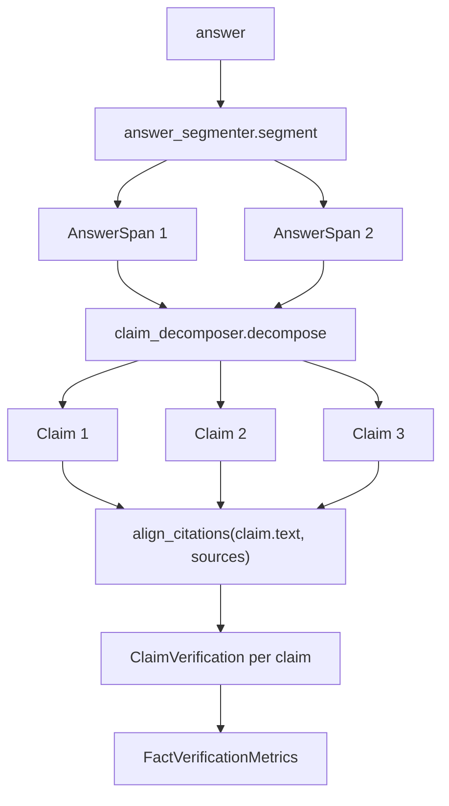

# Fact Verification

`align_citations` tags each answer segment with `"supported"`, `"partial"`, or `"unsupported"`. That is a sentence-level read. A sentence that combines a verified fact with an unverified one can land on `"partial"` without telling you which half was the problem. `verify_facts`, defined in `src/cite_right/fact_verification.py`, splits the answer into atomic claims first and verifies each one independently, so you can see exactly which assertions survived.

```python
from cite_right import SourceDocument, verify_facts

answer = "The product launched in March and sales exceeded 10 million units."
sources = [
    SourceDocument(
        id="press_release",
        text="The new product line was introduced to the market in March 2024.",
    )
]

result = verify_facts(answer, sources)
print(result.num_claims, result.num_verified, result.num_unverified)
print(result.partial_claims, result.unverified_claims)
```

The same pipeline that powers `align_citations` runs underneath. The difference is that the answer is decomposed before alignment and the per-span status is folded into per-claim results with aggregate metrics.

## What verify_facts Does

`verify_facts(answer, sources, ...)` segments the answer, decomposes each segment into atomic claims, runs `align_citations` on each claim's text against the same sources, and folds the per-span results into per-claim verdicts.



The end-to-end control flow: segment the answer, decompose into claims, align each claim, fold into per-claim verdicts, then aggregate metrics.

If the answer produces no claims at all (empty string, or every sentence stripped out), `verify_facts` returns an empty `FactVerificationMetrics` with `num_claims=0`, `verification_rate=1.0`, `avg_confidence=1.0`, and `min_confidence=1.0`. The empty path is the "nothing to verify" path; it is not a clean bill of health for the answer.

## Claim Decomposition

Decomposition is the step that turns a sentence into one or more atomic claims. `verify_facts` accepts any object that implements the `ClaimDecomposer` protocol from `src/cite_right/claims.py`:

```python
class ClaimDecomposer(Protocol):
    def decompose(self, span: AnswerSpan) -> list[Claim]: ...
```

A `Claim` is a frozen Pydantic model with `text`, `char_start`, `char_end`, the originating `source_span` (`AnswerSpan`), and a `claim_index` within that span. The `char_start` / `char_end` offsets are absolute 0-based half-open intervals in the original answer string, the same convention as `Citation` offsets.

### SimpleClaimDecomposer

`SimpleClaimDecomposer` is the default when you do not pass `claim_decomposer`. It returns the input `AnswerSpan` as a single `Claim` wrapping the entire span, with `claim_index=0`. Use it when sentence-level granularity is enough or when you do not want to add a dependency for clause splitting. It has no extra dependencies.

### SpacyClaimDecomposer

`SpacyClaimDecomposer` loads a spaCy model (default `"en_core_web_sm"`) and walks the dependency parse to find `conj` (conjunct) tokens. Each conjunct gets a split boundary built from the coordinating conjunction and any whitespace, or, when no `cc` child is present, from the preceding comma or semicolon. The resulting character boundaries are sorted, deduplicated, and applied to the span text to extract one claim per segment between boundaries. Claims with fewer than `min_claim_tokens` (default 2) tokens are dropped.

The decomposer requires the spaCy extra. Install it and the model before constructing one:

```bash
pip install "cite-right[spacy]==0.4.0"
python -m spacy download en_core_web_sm
```

The `__init__` raises `RuntimeError` with a clear message if `spacy` is not importable, or if the named model is not installed. Pass `model="..."` to use a different spaCy pipeline, and `min_claim_tokens=...` to tighten or relax the per-claim token floor.

If no `conj` tokens are found, `SpacyClaimDecomposer` falls back to a single `Claim` wrapping the whole span, the same shape `SimpleClaimDecomposer` returns. So the spaCy path is a refinement, not a guarantee of more claims.

```python
from cite_right import verify_facts
from cite_right import SpacyClaimDecomposer

decomposer = SpacyClaimDecomposer()
result = verify_facts(answer, sources, claim_decomposer=decomposer)
```

Reuse one `SpacyClaimDecomposer` instance across calls. The constructor loads the spaCy pipeline; calling `verify_facts` repeatedly with a fresh instance pays that cost every time.

## What verify_facts Accepts

The signature mirrors `align_citations` for the parts that the per-claim alignment needs, plus the decomposition knob and the verification thresholds.

```python
verify_facts(
    answer,
    sources,
    *,
    config: FactVerificationConfig | None = None,
    claim_decomposer: ClaimDecomposer | None = None,
    answer_segmenter: AnswerSegmenter | None = None,
    source_segmenter: Segmenter | None = None,
    tokenizer: Tokenizer | None = None,
    embedder: Embedder | None = None,
    backend: Literal["auto", "python", "rust"] = "auto",
) -> FactVerificationMetrics
```

`sources` accepts the same forms as `align_citations`: bare `str`, `SourceDocument`, or `SourceChunk`. Plain strings get auto-assigned ids (`"source_0"`, `"source_1"`, ...).

`answer_segmenter` defaults to `SimpleAnswerSegmenter`. `source_segmenter`, `tokenizer`, and `embedder` are forwarded into the per-claim `align_citations` call. `backend` follows the same `"auto"` / `"python"` / `"rust"` rules as `align_citations`; see [Rust Acceleration](../advanced/rust-acceleration.md) for the fallback semantics.

## FactVerificationConfig

`FactVerificationConfig` is a frozen Pydantic model with three fields.

`verified_coverage_threshold` is the minimum `answer_coverage` for a claim to be tagged `"verified"`. Default `0.6`, which matches the default `supported_answer_coverage` on `CitationConfig` so the two surfaces line up.

`partial_coverage_threshold` is the minimum `answer_coverage` for a claim to be tagged `"partial"`. Below it the claim is `"unverified"`. Default `0.3`.

`citation_config` is the `CitationConfig` forwarded into each per-claim `align_citations` call. When unset, `verify_facts` builds one with `top_k=3`, `min_answer_coverage=0.2`, and `supported_answer_coverage=cfg.verified_coverage_threshold`, so the per-claim `"supported"` / `"partial"` / `"unsupported"` semantics match `verify_facts`'s `"verified"` / `"partial"` / `"unverified"` rollup at the default threshold.

```python
from cite_right import CitationConfig, FactVerificationConfig, verify_facts

config = FactVerificationConfig(
    verified_coverage_threshold=0.7,
    partial_coverage_threshold=0.4,
    citation_config=CitationConfig(top_k=5, min_answer_coverage=0.3),
)
result = verify_facts(answer, sources, config=config)
```

The thresholds are applied to the best citation's `answer_coverage` component for each claim. The best citation is the one with the highest `score` among the citations `align_citations` returns for that claim.

## Per-Claim Verdicts

Each claim gets a `ClaimVerification`. The shape is a frozen Pydantic model:

```python
class ClaimVerification(BaseModel):
    claim: Claim
    status: Literal["verified", "partial", "unverified"]
    confidence: float
    best_citation: Citation | None = None
    all_citations: list[Citation] = []
    source_ids: list[str] = []
```

`status` is derived from the best citation's `answer_coverage`. At or above `verified_coverage_threshold` it is `"verified"`. At or above `partial_coverage_threshold` it is `"partial"`. Otherwise it is `"unverified"`. When the per-claim `align_citations` call returns no citations at all, the status is `"unverified"` with `confidence=0.0` and an empty `source_ids`.

`confidence` is the best citation's `answer_coverage` component. It is a coverage number in the same sense as the alignment pipeline's `answer_coverage`; it is not a calibrated probability.

`best_citation` is the highest-`score` `Citation` from the per-claim alignment, or `None` when no citation survived. `all_citations` is the full list. `source_ids` is the deduplicated set of `source_id` values across all citations on this claim.

## Aggregate Metrics

`FactVerificationMetrics` is the top-level return type.

```python
class FactVerificationMetrics(BaseModel):
    num_claims: int
    num_verified: int
    num_partial: int
    num_unverified: int
    verification_rate: float
    avg_confidence: float
    min_confidence: float
    claim_verifications: list[ClaimVerification] = []
    verified_claims: list[Claim] = []
    unverified_claims: list[Claim] = []
    partial_claims: list[Claim] = []
```

`num_claims` is the count after decomposition. `num_verified`, `num_partial`, and `num_unverified` are the per-status totals. `verification_rate` is `num_verified / num_claims` for non-empty input, or `1.0` for empty input. `avg_confidence` and `min_confidence` are taken across the per-claim confidences, with `1.0` substituted for empty input.

`claim_verifications` is the per-claim list in decomposition order. `verified_claims`, `partial_claims`, and `unverified_claims` are the same `Claim` objects partitioned by status, useful when you only need the text of the unsupported claims:

```python
for claim in result.unverified_claims:
    print(claim.text, claim.char_start, claim.char_end)
```

The `Claim.char_start` and `Claim.char_end` are offsets in the original answer string, so they line up with the same half-open convention as `Citation` offsets on the source side. A UI that highlights the answer can use the claim offsets to mark up the specific span that failed verification.

## Status Comes From Localized Citations

A claim's status is driven by the per-claim `align_citations` run, exactly the same pipeline that powers sentence-level status. That means:

- Status is set by the best exact `Citation`'s `answer_coverage`, not by embedding similarity. A high embedding score that never localizes is `retrieval_support`, not a `Citation`, and does not flip a claim to `"verified"`.
- Contradiction (negation, number mismatch, leftover n-gram slot, entity swap) on the candidate passage is what makes a span `"partial"` in the alignment pipeline. `verify_facts` reuses that signal: a claim whose best citation exists but contradicts the claim text lands in `"partial"`, not `"unverified"`.
- The default `verified_coverage_threshold` of `0.6` matches the default `supported_answer_coverage`, so a claim with the same per-claim alignment as a sentence-level `"supported"` span also gets `"verified"`. See [Citation Alignment](citation-alignment.md) for the citation pipeline in detail.

## When To Use verify_facts vs compute_hallucination_metrics

`verify_facts` and `compute_hallucination_metrics` are complementary surfaces, not alternatives.

`compute_hallucination_metrics` rolls the alignment results up to a single groundedness score and a hallucination rate. It is the right tool for a quality gate, a dashboard, or a regression test. See [Hallucination Detection](hallucination-detection.md) for the rollup view and the RAGTruth test numbers behind it.

`verify_facts` is the right tool when you need to point at the exact claim that failed. UIs that let users click on a flagged sentence and see "this part is supported, this part is not" need the per-claim offsets and texts. Pipelines that rewrite a single unsupported claim and resubmit need the per-claim granularity. Logs that need a list of the unsupported assertions need `unverified_claims`.

The two share the underlying `align_citations` output, so running both on the same answer is not a doubling of work if you already have the `SpanCitations`; for one-shot use, calling `verify_facts` once and reading the metrics is usually simpler than calling `align_citations` and then `compute_hallucination_metrics` separately.

## Installation And Dependencies

`verify_facts`, `FactVerificationConfig`, `FactVerificationMetrics`, `ClaimVerification`, `SimpleClaimDecomposer`, and `Claim` are in the base install. `SpacyClaimDecomposer` is in the base install too, but constructing one needs the spaCy runtime and the named model. See [Installation](../getting-started/installation.md) for the full set of extras and the Python version requirement.

```bash
pip install cite-right==0.4.0
pip install "cite-right[spacy]==0.4.0"
python -m spacy download en_core_web_sm
```

## Limits Of Claim Decomposition

Decomposition is syntactic. `SpacyClaimDecomposer` finds conjunct tokens in the dependency parse; it does not understand whether the two halves of a coordinated sentence are independent facts. A sentence that combines two claims in a non-coordinated structure ("The vaccine is safe, which is why it was approved.") will pass through as a single claim. A sentence that contains a coordinated structure that is not two independent facts ("We grew and we learned.") will be split anyway.

The verification itself only checks explicit textual support. Logical inferences that are true given the source but not stated verbatim are not verified. Numerical claims that match the source approximately but not exactly will be tagged by the same coverage thresholds as the underlying alignment, not by a separate numerical match step. The RAGTruth numbers on [Hallucination Detection](hallucination-detection.md) carry over: the tagger overflags, and many spans tagged `"unverified"` are not gold hallucinations.

## Related Pages

- [Citation Alignment](citation-alignment.md) — the per-span `align_citations` contract that `verify_facts` runs underneath.
- [Hallucination Detection](hallucination-detection.md) — the rollup view of the same alignment output, with the RAGTruth test numbers.
- [Segmenters](../configuration/segmenters.md) — the answer and source segmenters forwarded into `verify_facts`.
- [Installation](../getting-started/installation.md) — the `[spacy]` extra and the `en_core_web_sm` model download.
- [How It Works](how-it-works.md) — the index-first retrieval path and the embedder add-ons.
- [Rust Acceleration](../advanced/rust-acceleration.md) — the `backend` selection and the fallback when `cite_right._core` is missing.
