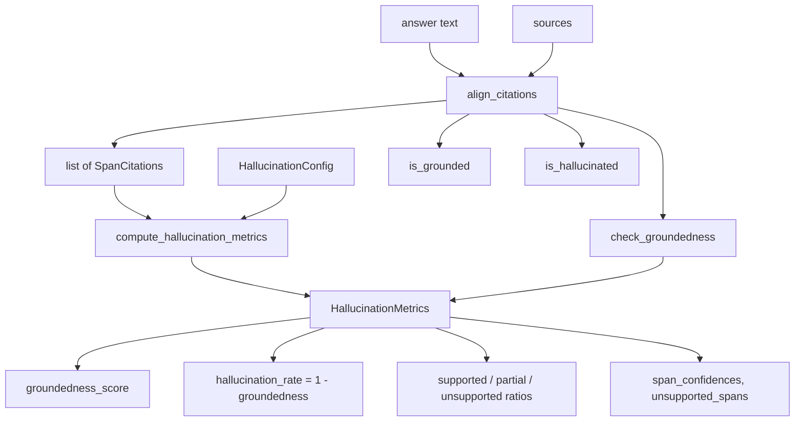

# Hallucination Detection

Cite-Right is a groundedness and citation tagger, not a clean hallucination detector. It marks whether each answer span has localized source support. That is useful for highlighting, quality gates, and aggregate groundedness scores. It is not a substitute for a dedicated hallucination classifier.

On RAGTruth test (2,675 answers), 0.4.0 quality matched 0.3.1. False-supported on gold hallucinations is about 1.6%. Unsupported precision is about 14%. The tagger overflags: many spans tagged `"unsupported"` are not gold hallucinations. If `"partial"` counts as not fully supported, gold hallucinations are rarely blessed as `"supported"`.

This page covers the rollup surface: `compute_hallucination_metrics`, the `HallucinationMetrics` and `SpanConfidence` shapes, the `HallucinationConfig` knob, and the `is_grounded` / `is_hallucinated` / `check_groundedness` convenience helpers. The per-span `align_citations` contract is on [Citation Alignment](citation-alignment.md); the per-claim view is on [Fact Verification](fact-verification.md).

## Quick Example

```python
from cite_right import SourceDocument, align_citations, compute_hallucination_metrics

answer = """The company reported record profits in Q4.
They announced plans to expand into Asia.
The CEO will retire next month."""

sources = [
    SourceDocument(
        id="earnings",
        text="Fourth quarter profits reached an all-time high, beating analyst expectations.",
    )
]

results = align_citations(answer, sources)
metrics = compute_hallucination_metrics(results)

print(f"Groundedness: {metrics.groundedness_score:.1%}")
print(f"Hallucination rate: {metrics.hallucination_rate:.1%}")
```

The first sentence should align with the source. The second and third have no source support and will contribute to the hallucination rate. Because unsupported precision is low, do not treat that rate as a hallucination probability.

## What "Hallucination" Means Here

In the context of retrieval-augmented generation, hallucination usually means generated content that cannot be traced back to the retrieved sources. That may occur when the model draws on parametric knowledge rather than the provided context, when it makes logical leaps not supported by the text, or when it generates plausible-sounding but unfounded claims.

Cite-Right does not classify those cases with a trained detector. It analyzes citation alignment results. Answer spans that produce citations are `"supported"` or `"partial"`. Spans with no surviving citation are `"unsupported"`. Cheap contradiction (negation, number, leftover n-gram slot, entity swap) downgrades to `"partial"`, never `"unsupported"`. The status literal is `"partial"`, never `"partially_supported"`.

Treat `"unsupported"` as "no localized citation survived," not as a high-precision hallucination label. The library overflags on RAGTruth, so an `"unsupported"` tag is a recall-promising signal that a span needs a second look, not a calibrated probability that the span is fabricated.

## Data Flow

`compute_hallucination_metrics` takes the same `SpanCitations` list that `align_citations` returns and folds the per-span status and best-citation confidence into aggregate counters and ratios. The convenience helpers wrap the same call so you can hand them an answer and a list of sources directly.



`SpanCitations` is the single shared input surface. The convenience helpers build it via `align_citations` and then call `compute_hallucination_metrics` internally, so the rollup logic is identical whether you call the metrics function or one of the helpers.

## HallucinationMetrics

`compute_hallucination_metrics` returns a `HallucinationMetrics` object. It is a frozen Pydantic model in `src/cite_right/hallucination.py` with the following fields.

### Aggregate Scores

`groundedness_score` is a weighted confidence score between 0 and 1, computed as `weighted_confidence_sum / total_chars` across the answer. Higher values indicate better grounding in sources. The confidence for a span is the best citation's `answer_coverage` component, or `0.0` when the span has no citations. The weighted numerator only accumulates when the span counts as grounded, so a span excluded from groundedness still contributes its character length to the denominator.

`hallucination_rate` is `1 - groundedness_score`. It is the proportion of content that the tagger did not count as grounded, also between 0 and 1. With the default `HallucinationConfig`, `"partial"` spans can contribute to groundedness. If you need a stricter reading, set `include_partial_in_grounded=False` so only `"supported"` counts.

```python
if metrics.groundedness_score > 0.8:
    print("Answer is well-grounded")
elif metrics.hallucination_rate > 0.3:
    print("Warning: Significant ungrounded content")
```

Thresholds like these are application policy, not validated hallucination cutoffs. The RAGTruth test shows the tagger overflags, so a high hallucination rate is a recall signal, not a calibrated probability.

### Span Ratios

Three ratio metrics describe how answer content distributes across support levels, weighted by character count. They sum to 1.0 and provide a quick overview of answer composition.

`supported_ratio` indicates what proportion of the answer text is fully supported by sources.

`partial_ratio` indicates what proportion has partial support, meaning some citation was found but it may not fully cover the claim, or contradiction downgraded the span.

`unsupported_ratio` indicates what proportion has no adequate source support.

### Span Counts

Three count metrics provide raw numbers rather than ratios, useful for understanding the structure of the answer independent of span length.

`num_supported` counts answer spans with full source support.

`num_partial` counts spans with partial support.

`num_unsupported` counts spans without adequate support.

`num_spans` is the total number of answer spans analyzed.

### Confidence Statistics

`avg_confidence` reports the average per-span confidence across all spans (unweighted by character length).

`min_confidence` reports the lowest per-span confidence, identifying the weakest point in the answer.

### Weak Citation Tracking

`num_weak_citations` counts spans where a citation was found but its `answer_coverage` is below `HallucinationConfig.weak_citation_threshold` (default `0.4`). These represent borderline cases that may warrant manual review.

### Problem Span Identification

`unsupported_spans` is a list of `AnswerSpan` objects that received no citations. These are the pieces of text with no localized citation, which may or may not be gold hallucinations.

`weakly_supported_spans` is a list of `AnswerSpan` objects whose best citation fell below the weak threshold. They have evidence, but the evidence is thin.

```python
if metrics.unsupported_spans:
    print("Spans with no localized citation:")
    for span in metrics.unsupported_spans:
        print(f"  '{span.text}'")
```

### Per-Span Details

`span_confidences` provides a list of `SpanConfidence` objects with detailed information about each answer span, in alignment order.

```python
for conf in metrics.span_confidences:
    print(f"Text: {conf.span.text}")
    print(f"Confidence: {conf.confidence:.2f}")
    print(f"Status: {conf.status}")
    print(f"Sources: {conf.source_ids}")
```

`SpanConfidence` is itself a frozen Pydantic model with `span` (the `AnswerSpan`), `status`, `confidence`, `is_grounded`, `best_citation_score`, and `source_ids` (the deduplicated set of `source_id` values across the span's citations).

### Empty Input

When the input `span_citations` is empty, `compute_hallucination_metrics` returns a degenerate metrics object with `groundedness_score=1.0`, `hallucination_rate=0.0`, and every ratio and confidence set to its "nothing to verify" value. The empty path is the "nothing to verify" path; it is not a clean bill of health for the answer.

## How Confidence And Groundedness Are Computed

Per-span confidence comes from the best citation only. The accumulator sorts each span's `citations` by `(citation_confidence, citation.score)` and picks the first, where `citation_confidence` is `float(citation.components.get("answer_coverage", 0.0))`. When the span has no citations at all, confidence is `0.0` and `is_grounded` is `False`.

A span counts as grounded when its status is `"supported"`, or when its status is `"partial"` and `include_partial_in_grounded` is `True`. `"unsupported"` never counts as grounded. The accumulator adds `confidence * span_len` to the grounded numerator for grounded spans, then divides by the total character length to produce `groundedness_score`.

`avg_confidence` and `min_confidence` are unweighted across spans, so a long supported sentence and a short unsupported sentence have equal weight in the per-span summary. That is different from `groundedness_score`, which is character-weighted. Use the ratios to understand composition, the counts to understand structure, and the character-weighted score for a single dashboard number.

## Configuration

`HallucinationConfig` is a frozen Pydantic model with two fields.

```python
from cite_right import HallucinationConfig, compute_hallucination_metrics

config = HallucinationConfig(
    weak_citation_threshold=0.4,
    include_partial_in_grounded=True,
)

metrics = compute_hallucination_metrics(results, config=config)
```

`weak_citation_threshold` is the minimum `answer_coverage` for a citation to be considered adequate. Citations below this threshold are counted as weak and listed in `weakly_supported_spans`. Default `0.4`.

`include_partial_in_grounded` controls whether `"partial"` matches contribute to the groundedness score. Setting this to `False` produces a stricter groundedness metric that only counts fully supported spans. Default `True`. If `"partial"` is excluded, gold hallucinations are rarely counted as `"supported"`.

## Convenience Functions

For common use cases, high-level convenience functions in `src/cite_right/convenience.py` provide quick answers. They all internally call `align_citations` and then `compute_hallucination_metrics`, so the rollup logic is shared with the direct API.

### `is_grounded`

Returns a boolean indicating whether the answer meets a groundedness threshold.

```python
from cite_right import is_grounded

if is_grounded(answer, sources, threshold=0.6):
    # Proceed with the response
    pass
else:
    # Request clarification or regenerate
    pass
```

`threshold` defaults to `0.5`. The function returns `metrics.groundedness_score >= threshold`. It inherits the same overflag behavior as `compute_hallucination_metrics`. The threshold is application policy, not a validated hallucination cutoff.

### `is_hallucinated`

Returns a boolean indicating whether the hallucination rate exceeds a threshold. This is the inverse of `is_grounded` against a different cut.

```python
from cite_right import is_hallucinated

if is_hallucinated(answer, sources, threshold=0.3):
    print("Warning: Answer may contain ungrounded content")
```

`threshold` defaults to `0.5` and the function returns `metrics.hallucination_rate > threshold` (strict greater-than, not `>=`). It is still a groundedness check, not a high-precision hallucination detector.

### `check_groundedness`

Combines alignment and metrics computation in a single call, returning the full `HallucinationMetrics` object.

```python
from cite_right import check_groundedness

metrics = check_groundedness(answer, sources)
print(f"Groundedness: {metrics.groundedness_score:.1%}")
print(f"Problematic spans: {len(metrics.unsupported_spans)}")
```

Useful when you need both the boolean decision and the detailed metrics for logging or analysis. The `backend`, `tokenizer`, `answer_segmenter`, `source_segmenter`, and `embedder` arguments are forwarded into `align_citations`. The `config` argument is the `CitationConfig`; the `hallucination_config` argument is the `HallucinationConfig`.

## Integration Patterns

### Quality Gate

Use citation status as a quality gate before presenting responses to users. Prefer inspecting `"supported"` versus `"partial"` versus `"unsupported"` per span, or reading the supported ratio, over treating the hallucination rate as a calibrated probability.

```python
def generate_with_verification(query, sources):
    answer = generate_answer(query, sources)
    metrics = check_groundedness(answer, sources)

    if metrics.groundedness_score < 0.5:
        return regenerate_with_emphasis_on_sources(query, sources)

    return answer
```

### User Interface Indicators

Display confidence indicators in the user interface based on citation metrics, and show the actual evidence offsets rather than a red/green hallucination badge.

```python
def get_confidence_indicator(metrics):
    if metrics.groundedness_score > 0.8:
        return "high_confidence"
    elif metrics.groundedness_score > 0.5:
        return "moderate_confidence"
    else:
        return "low_confidence"
```

### Logging And Monitoring

Track groundedness and unsupported rates over time to identify model or prompt degradation. Log per-status counts alongside the aggregate score, so overflag does not look like a sudden hallucination spike when the underlying model has not changed.

```python
import logging


def log_hallucination_metrics(query, answer, metrics):
    logging.info(
        "hallucination_check",
        extra={
            "query_hash": hash(query),
            "groundedness": metrics.groundedness_score,
            "hallucination_rate": metrics.hallucination_rate,
            "unsupported_count": metrics.num_unsupported,
            "partial_count": metrics.num_partial,
            "supported_count": metrics.num_supported,
        },
    )
```

## Relation To `verify_facts`

`compute_hallucination_metrics` and `verify_facts` are complementary surfaces, not alternatives. `compute_hallucination_metrics` rolls the alignment results up to a single groundedness score and a hallucination rate. It is the right tool for a quality gate, a dashboard, or a regression test.

`verify_facts` is the right tool when you need to point at the exact claim that failed. It splits the answer into atomic claims first, so a sentence that combines a verified fact with an unverified one no longer hides the unverified half behind a single `"partial"`. See [Fact Verification](fact-verification.md) for the per-claim view.

The two share the underlying `align_citations` output, so running both on the same answer is not a doubling of work if you already have the `SpanCitations`; for one-shot use, calling `verify_facts` once and reading the metrics is usually simpler than calling `align_citations` and then `compute_hallucination_metrics` separately.

## Limitations

Hallucination detection identifies answer content that lacks localized source support. It does not verify factual accuracy beyond the provided sources. If a source document itself contains errors, content derived from it is still marked as grounded.

Unsupported precision is about 14% on RAGTruth test. Grounded paraphrases are less overflagged than in 0.3.1 (content-word overlap can emit a citation when sequential Smith-Waterman coverage is low), but the tagger still overflags relative to gold hallucination labels. In practice, treat `"unsupported"` as "no localized citation survived," and treat the hallucination rate as a recall signal for human review rather than a calibrated probability.

The detection is limited to explicit textual alignment plus the cheap contradiction checks above. Logical inferences that are correct but not stated in sources will often be marked as unsupported. Applications requiring inference verification need additional techniques beyond citation alignment.

## Related Pages

- [Citation Alignment](citation-alignment.md) — the per-span `align_citations` contract that `compute_hallucination_metrics` rolls up.
- [Fact Verification](fact-verification.md) — the per-claim view of the same alignment output.
- [How It Works](how-it-works.md) — the index-first retrieval path and the embedder add-ons that produce the `SpanCitations` the metrics consume.
- [Citation Config](../configuration/citation-config.md) — the alignment-side thresholds (`supported_answer_coverage`, `min_answer_coverage`) that drive the `"supported"` and `"partial"` statuses the rollup reads.
