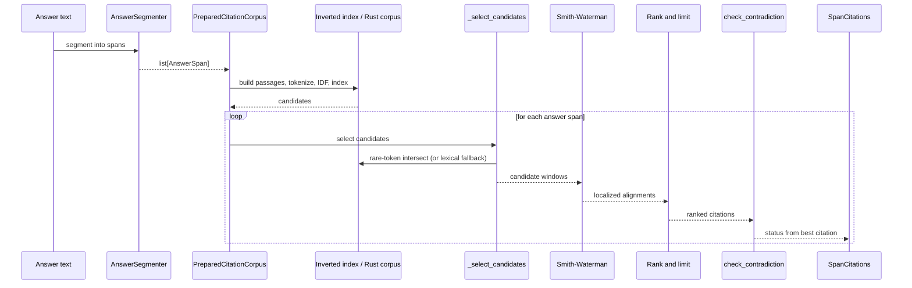
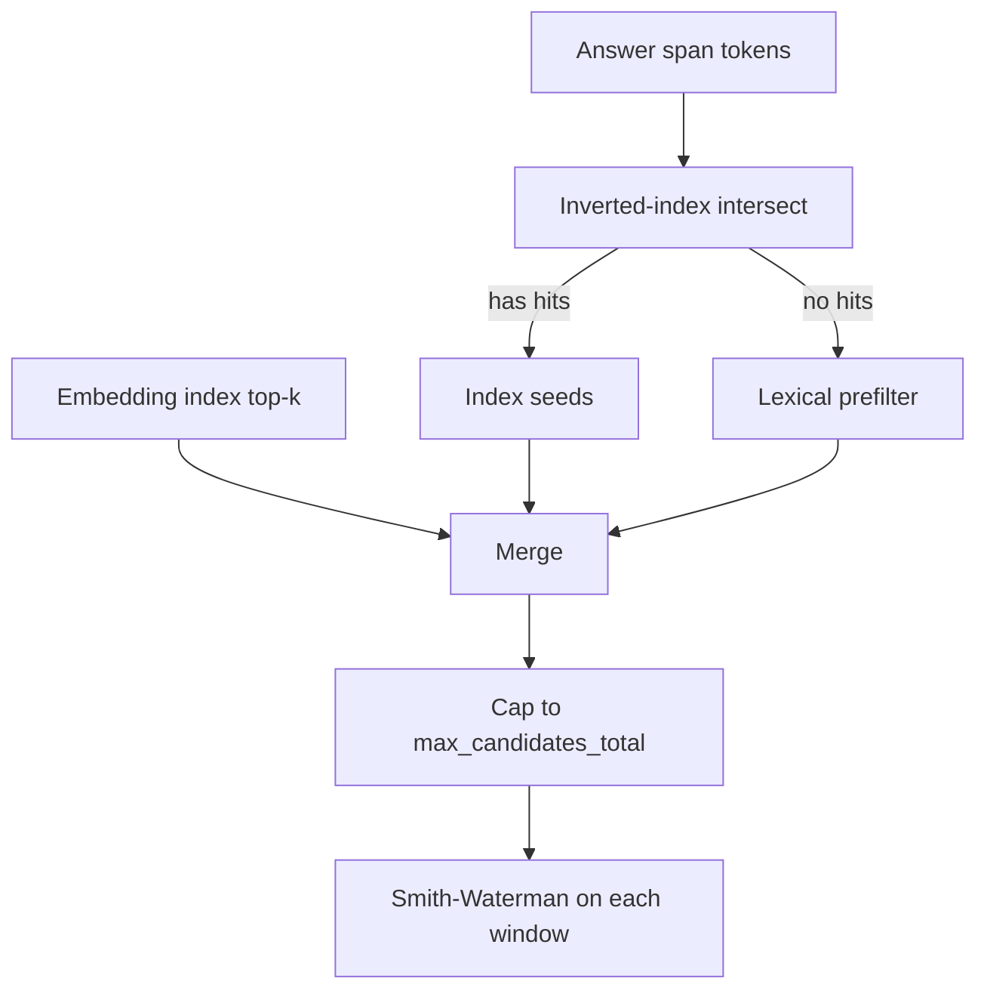

# How It Works

Cite-Right takes a generated answer plus a set of source documents and returns per-span citations with character-accurate offsets into the source. The pipeline lives in `src/cite_right/citations.py` and the prepared-corpus helpers in `src/cite_right/core/prepared_corpus.py`. The public entry point is `align_citations`, optionally accelerated by the `PreparedCitationCorpus` form. The public API is unchanged across 0.4.0: span status is exactly one of `"supported"`, `"partial"`, or `"unsupported"`. The literal is `"partial"`, never `"partially_supported"`.

This page is the end-to-end orientation. The I/O surface (`SourceDocument`, `SourceChunk`, `SpanCitations`, `char_start` / `char_end`) is on [Citation Alignment](citation-alignment.md). The advanced knobs (multi-span evidence, embedder recall, the Rust extension) have their own pages: [Multi-Span Evidence](../advanced/multi-span-evidence.md), [Embedding Retrieval](../advanced/embedding-retrieval.md), [Rust Acceleration](../advanced/rust-acceleration.md), and [Performance Tuning](../advanced/performance-tuning.md).

## A Small Run

A minimal call exercises the whole pipeline.

```python
from cite_right import SourceDocument, align_citations

answer = "The company reported record revenue in Q4."
sources = [
    SourceDocument(
        id="earnings_call",
        text="During the earnings call, the CEO announced that the company reported record revenue in Q4 of 2024.",
    )
]

results = align_citations(answer, sources)
for result in results:
    print(result.answer_span.text, result.status)
    for citation in result.citations:
        print(citation.evidence, citation.char_start, citation.char_end)
```

`align_citations` builds a `PreparedCitationCorpus` from the sources, segments the answer, picks candidate windows, runs Smith-Waterman, ranks the survivors, runs the contradiction check, and assigns a status. The offsets on each `Citation` are half-open into the source text: `source.text[citation.char_start:citation.char_end] == citation.evidence`.

## End-To-End Pipeline



The block-level steps below follow the same sequence. The default Rust path uses the inverted-index intersect in step 4; the fallback path replaces it with lexical selection. Either way, Smith-Waterman still localizes.

### Step 1: Answer Segmentation

`align_citations` first calls the answer segmenter to split the answer into spans. The default is `SimpleAnswerSegmenter`; the source segmenter is `SimpleSegmenter` by default and is the one used for passage creation. Segmenter choice is granularity: finer segments produce more spans, each with its own status and citations. See [Segmenters](../configuration/segmenters.md) for the alternatives (`SpacySegmenter`, `PySBDSegmenter`).

### Step 2: Source Passage Creation

Each source is windowed into overlapping passages, controlled by `CitationConfig.window_size_sentences` and `window_stride_sentences`. A 3-sentence window with stride 1 puts each sentence in multiple windows, which improves the chance that a good alignment exists. Windowing happens during prepare (`PreparedCitationCorpus.from_sources`).

### Step 3: Tokenization With One Tokenizer

Both the answer spans and the source passages run through the same tokenizer instance (the default `SimpleTokenizer`). The tokenizer applies Unicode NFKC normalization and case-folding, so superficially different tokens map to the same ID. Each token keeps its `(start_char, end_char)` in the original text, so once Smith-Waterman matches tokens, the offsets can be re-expressed as character positions.

With the default `SimpleTokenizer` and `SimpleSegmenter`, the Rust prepare path takes over tokenization and windowing (`rust_tokenize_and_prepare`); the Python tokenizer's vocabulary is then synchronized from Rust so the answer-side tokens map to the same IDs as the source-side ones. A custom tokenizer or segmenter takes the Python fallback path.

### Step 4: Index-First Candidate Selection

Candidate selection reduces the search space before alignment. 0.4.0 is index-first on the default Rust path: an inverted index maps tokens to passage windows, and for each answer span the rare-token posting lists are intersected. Only those hits move on to Smith-Waterman. `max_candidates_lexical` (default 200) caps how many seeds the index can keep.

The index is a recall shortcut. Smith-Waterman still localizes every citation. The index chooses which windows get aligned; alignment is not skipped.

When the index returns no hits, the older lexical prefilter is the fallback: for each candidate passage, an IDF-weighted overlap with the answer tokens is computed and the top scoring passages move on. The lexical prefilter is also the candidate-selection path when the Rust extension is missing or when a custom tokenizer/segmenter is in use, because then `PreparedCitationCorpus.from_sources` leaves `inverted_index=None` and `rust_corpus=None`.

When an embedder is set, `_add_embedding_candidates` can add non-index windows to the candidate set before alignment. Those extras still need Smith-Waterman. Lexical scores are filled only for inverted-index seeds, so embedding-only extras keep `lexical_score == 0.0`. `retrieval_support` is the channel for passages that the index or embedder selected but Smith-Waterman could not localize; it is not a `Citation` and never flips status.



### Step 5: Smith-Waterman Alignment

Each surviving candidate is aligned to the answer span by Smith-Waterman, a dynamic-programming local-alignment algorithm. The implementation in `src/cite_right/core/aligner_py.py` is the reference; the Rust equivalent is exposed by `RustSmithWatermanAligner` in `src/cite_right/core/aligner_rust.py`. The Rust backend reproduces the Python traceback exactly, including match counts and floating-point rounding, so the two backends agree on status and offsets on the same input.

The alignment returns a score plus the token range within the candidate passage. Two coverage signals are then computed on the same alignment:

- **Answer coverage**: the fraction of answer tokens that appear in the alignment. This is the primary signal.
- **Evidence coverage**: the fraction of aligned evidence tokens that match. Penalizes over-long evidence that merely contains the answer.

A citation is emitted when the alignment score clears `min_alignment_score`, the token range is non-empty, and either the sequential answer coverage or the content-word coverage on the same passage clears `min_answer_coverage`. The content-word path uses the token vocabulary to exclude stopwords, so a Smith-Waterman hit on only stopwords (e.g. matching "the" twice) is not enough. Sequential Smith-Waterman coverage is the main path; content-word overlap is what keeps grounded how-to and news paraphrases from being tagged `"unsupported"` when the shared content words are reordered.

For structured field:value sources (Data2txt hours, amenities, business attributes), a second Smith-Waterman pass runs per matching candidate with `gap_score=0` on the answer text alone. Faithful rewrites of hours or amenities can then localize as `"supported"` or `"partial"`. Invented fields that do not match any field line stay `"unsupported"`. Range dashes in fields are split into spaces so "Monday-Friday" tokenizes as two day names.

### Step 6: Offset Rebase

The token range inside the candidate passage has to be turned back into a half-open character range inside the source document. Each candidate carries the absolute `doc_char_start` / `doc_char_end` of its passage plus a per-token `(start_char, end_char)` relative to that passage. A `SourceChunk` further adds a `base_doc_offset` so chunk-local offsets can be lifted to the original document. The final `char_start` / `char_end` on each `Citation` is the sum of the document offset, the passage offset, and the token-level offset inside the passage. `evidence` is the slice of source text at that exact range, and `source.text[citation.char_start:citation.char_end] == citation.evidence` holds.

When `multi_span_evidence=True`, the alignment can return disjoint `match_blocks` that are merged into a list of `EvidenceSpan` objects. The legacy `evidence` / `char_start` / `char_end` fields stay a single contiguous enclosing span for backward compatibility; precise attribution should use `evidence_spans`. See [Multi-Span Evidence](../advanced/multi-span-evidence.md).

### Step 7: Ranking, Contradiction Check, and Status

After all candidates are aligned, the surviving citations are sorted deterministically, deduplicated, trimmed, and passed to the contradiction check, which finally sets the span status.

**Ranking.** The sort key is built by `_citation_sort_key` in `src/cite_right/citations.py`. The primary key is `-citation.score`. Ties break on `prefer_source_order`:

- Default (`prefer_source_order=True`): earlier `source_index`, then earlier `char_start`, then longer evidence span, then `candidate_index`.
- `prefer_source_order=False`: earlier `char_start`, then longer evidence span, then `source_index`, then `candidate_index`.

After sorting, the same source with the same evidence-span tuple is collapsed (deduped), `max_citations_per_source` caps how many citations any one source contributes, and the list is trimmed to `top_k`. `retrieval_support` is ranked independently by `retrieval_score` and trimmed to `max_retrieval_support`.

**Contradiction.** `check_contradiction` in `src/cite_right/contradiction.py` is the cheap channel that runs over the **full candidate passage**, not the truncated Smith-Waterman evidence. Truncated evidence hides leftover tokens (e.g. "BC" or "of which came in the first half") that would otherwise make the slot mismatch visible. The check fires on:

- Negation mismatch: one side has a negation marker, the other does not.
- Number mismatch: numbers differ between the answer and the candidate.
- Leftover n-gram slot: a shared number attaches to different content words in each side.
- Entity swap: capitalized entities differ between the two sides.
- Temporal / polarity mismatch: BC vs ago, oppose vs support, and similar paired markers.

When any of those fire against the best-ranked citation, the span status is forced to `"partial"`. The status is never forced to `"unsupported"` by contradiction: there is evidence, it just conflicts with the claim. So source "The vaccine is safe and effective." and answer "The vaccine is not safe." resolves to `"partial"` with citations, not to `"unsupported"`. Shared tokens that would otherwise bless a contradictory statement as `"supported"` are downgraded for the same reason.

**Status.** Status comes from the top-ranked `Citation`'s `answer_coverage` component, not from its overall score. The exact rule:

- If the best citation's answer coverage meets `supported_answer_coverage` (default `0.6`) and no contradiction fired, the span is `"supported"`.
- If citations exist but `answer_coverage` is below the threshold, or a contradiction fired, the span is `"partial"`.
- If no citations survive filtering, the span is `"unsupported"`.

`retrieval_support` is intentionally outside this decision: a high embedding score that never localizes is evidence-of-interest, not a grounded citation. It is the diagnostic that a recall signal fired but Smith-Waterman could not pin a span.

## Scoring Components

The final citation `score` is a weighted sum over the components in `Citation.components`, exposed in `src/cite_right/citations.py` (`_compute_final_score`):

```
score = w_alignment   * normalized_alignment
      + w_coverage_a  * answer_coverage
      + w_coverage_e  * evidence_coverage
      + w_lexical     * lexical_score
      + w_embedding   * max(0, embedding_score)
```

The default weights live on `CitationWeights` (`alignment=1.0`, `answer_coverage=1.0`, `evidence_coverage=0.0`, `lexical=0.5`, `embedding=0.5`). The Smith-Waterman score, the matched-token count, and the per-evidence-span geometry are all included as components for inspection and tuning. Applications that need high precision can raise `w_alignment` and `w_coverage_a`; applications that tolerate paraphrase can lean on `w_embedding`.

## Three Paths Through The Pipeline

The same `align_citations` call can take three routes. The route is decided by what is on the classpath and on the call.

**Default / Rust path.** `SimpleTokenizer` + `SimpleSegmenter` and `cite_right._core` present. `_from_sources_rust` builds the inverted index, IDF, and passage windows in Rust and keeps per-passage token data on the Rust `PreparedCorpus` for on-demand fetches. The Python tokenizer's vocabulary is then synchronized from Rust. The candidate selector calls `rust_corpus.query_index` for the conjunctive rare-token intersect. Smith-Waterman still localizes.

**Fallback path.** Rust extension missing, or a custom tokenizer or segmenter is supplied. `PreparedCitationCorpus.from_sources` runs the Python prepare path, leaving `inverted_index=None` and `rust_corpus=None`. `_select_candidates` falls back to lexical prefilter (and still to embedding extras when an embedder is set). Smith-Waterman still localizes on `SmithWatermanAligner`. The legacy JSON-shaped `rust_build_citations_fast` and the newer `PreparedCorpus.build_citations` paths are skipped silently.

**Embedder path.** An `Embedder` is passed. The candidate selector queries the index first; `_add_embedding_candidates` then adds high-cosine-similarity passages that the index may have missed. Those extras still go through Smith-Waterman. The embedding index is built on the prepared candidates. Embedding-only `retrieval_support` still respects `min_embedding_similarity`. Rust prepare still runs in this case when `SimpleTokenizer` and `SimpleSegmenter` are in use; the 0.3.x skip of Rust prepare on the embedder path is gone.

## Determinism

Given the same inputs and configuration, Cite-Right produces identical outputs across runs. The pure-Python aligner is the reference; the Rust extension reproduces its behavior exactly, including tie-breaking order and floating-point rounding. Contract tests compare the two backends for status, offsets, and `evidence_spans` on a corpus of inputs. That property matters for debugging, regression tests, and any downstream system that fingerprints outputs.

## Performance Characteristics

The pipeline is shaped to avoid Smith-Waterman on the entire source corpus:

- Tokenization is linear in text length (`SimpleTokenizer` is a single pass through the input).
- Index-first retrieval makes candidate selection proportional to posting-list intersection on rare tokens, not to `answer_spans * passages`.
- Smith-Waterman remains quadratic in the length of the sequences being aligned, but it runs only on index hits (plus optional embedding extras), not on every passage.

On the 50-case pack with no embedder, 0.4.0 p50 wall time is about 12.4ms versus about 175.8ms in 0.3.1, roughly 14×. Sentence-per-passage (spp) is 81.3% versus 83.4%. RAGTruth test quality on 2,675 answers matched 0.3.1. Released wheels are abi3 (`abi3-py311`) and include linux/aarch64 plus an sdist. Install with `pip install cite-right==0.4.0`. The optional embedder adds encoding cost on top of the no-embedder numbers. See [Performance Tuning](../advanced/performance-tuning.md) and [Rust Acceleration](../advanced/rust-acceleration.md) for the knobs that move those numbers.
