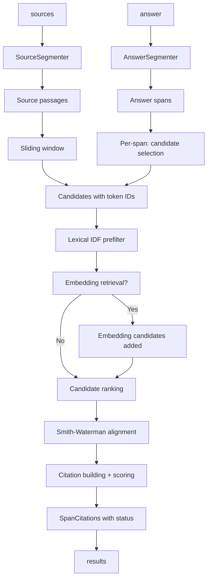

## Install

```bash
pip install cite-right
```

For embedding-backed retrieval (recommended for paraphrased answers):

```bash
pip install "cite-right[embeddings,tiktoken]"
```

cite-right requires Python 3.11+. The Rust extension (`cite_right._core`) is optional and loaded automatically when available; the pure-Python path is always functional.

## Minimal working example

```python
from cite_right import SourceDocument, align_citations

answer = (
    "GEPA (Genetic-Pareto) outperforms GRPO by up to 19% on Qwen3 8B "
    "while requiring up to 35x fewer rollouts."
)
sources = [
    SourceDocument(
        id="gepa_intro",
        text=(
            "To operationalize this, we introduce GEPA (Genetic-Pareto), a reflective prompt "
            "optimizer for compound AI systems that merges textual reflection with multi-objective "
            "evolutionary search."
        ),
    ),
    SourceDocument(
        id="grpo_results",
        text=(
            "Our results show that GEPA demonstrates robust generalization and is highly sample efficient: "
            "on Qwen3 8B, GEPA outperforms GRPO (24,000 rollouts with LoRA) by up to 19% while requiring up to "
            "35x fewer rollouts."
        ),
    ),
]

results = align_citations(answer, sources)
for result in results:
    print(result.answer_span.text, result.status)
    for citation in result.citations:
        source_doc = sources[citation.source_index]
        evidence = source_doc.text[citation.char_start : citation.char_end]
        print(f"  [{citation.source_id}] {evidence}")
```

Output:

```
GEPA (Genetic-Pareto) outperforms GRPO by up to 19% on Qwen3 8B while requiring up to 35x fewer rollouts. supported
  [grpo_results] GEPA outperforms GRPO (24,000 rollouts with LoRA) by up to 19% while requiring up to 35x fewer rollouts.
```

## Two public entry points

cite-right exposes two ways to align citations:

### `align_citations` (one-shot)

```python
from cite_right import align_citations, CitationConfig

results = align_citations(
    answer,
    sources,
    config=CitationConfig(top_k=1),  # top_k citations per span
)
```

This convenience function bundles source preparation and alignment into a single call. Internally it calls `PreparedCitationCorpus.from_sources()` followed by `corpus.align()`. Use this for single-answer workloads or when source corpora change between calls.

### `PreparedCitationCorpus` (amortized)

```python
from cite_right import PreparedCitationCorpus, CitationConfig

# Prepare once — tokenize, segment, and index all sources
corpus = PreparedCitationCorpus.from_sources(
    sources,
    config=CitationConfig(),
)

# Align many answers against the same corpus without re-preparing
for answer in batch:
    results = corpus.align(answer)
```

`PreparedCitationCorpus` separates the expensive prepare phase (segmentation, tokenization, IDF computation, optional embedding indexing) from the per-answer alignment phase. Use this when the same source set is reused across many answers, such as in batch RAG evaluation or server-side pipelines.

## Return value

`align_citations` returns `list[SpanCitations]` — one entry per answer sentence or clause. Each `SpanCitations` contains:

| Field | Type | Description |
|---|---|---|
| `answer_span` | `AnswerSpan` | The answer segment with character offsets into the full answer |
| `citations` | `list[Citation]` | Ranked exact citations (best first); empty if no alignment passed thresholds |
| `retrieval_support` | `list[RetrievalSupport]` | Semantically similar passages that lacked exact alignment |
| `status` | `Literal["supported", "partial", "unsupported"]` | Overall citation quality for this span |

Each `Citation` carries character-accurate `char_start` / `char_end` offsets into the original source document, ready for UI highlighting:

```python
citation = results[0].citations[0]
source_doc = sources[citation.source_index]
assert source_doc.text[citation.char_start : citation.char_end] == citation.evidence
```

## Status semantics

Every `SpanCitations` carries a `status` that describes how well the answer span is grounded:

| Status | Meaning |
|---|---|
| `supported` | Top citation's `answer_coverage` ≥ `supported_answer_coverage` (default **0.6**) and no contradiction detected |
| `partial` | Has citations but below the supported threshold; or a contradiction was found between answer and cited passage |
| `unsupported` | No exact citations found for this span |

`partial` is the literal value. There is no `partially_supported` status.

Status is determined by `_span_status()` in `src/cite_right/citations.py`:

1. **No citations → `unsupported`**
2. **Contradiction detected → `partial`** (contradiction downgrades even a high-coverage citation)
3. **`answer_coverage` ≥ `supported_answer_coverage` → `supported`**
4. **Otherwise → `partial`**

`retrieval_support` is surfaced for transparency but does **not** influence status. A span with only retrieval support (no exact alignment) is still marked `unsupported`.

## Backend selection

The `backend` parameter controls whether alignment uses the Rust extension or pure Python:

| Value | Behavior |
|---|---|
| `"auto"` (default) | Use Rust if available; silently fall back to Python if the extension is absent or incomplete |
| `"python"` | Force pure-Python Smith-Waterman; Rust is never used |
| `"rust"` | Require Rust; raises `RuntimeError` if the extension cannot be loaded or lacks required exports |

`backend="auto"` is the safe default. The Rust extension is preferred because it accelerates candidate retrieval and alignment, but cite-right runs correctly without it.

## Configuration presets

`CitationConfig` ships with named presets:

```python
from cite_right import CitationConfig

config = CitationConfig.strict()       # High-precision: supported_answer_coverage=0.7, top_k=2
config = CitationConfig.permissive()  # Lenient: supported_answer_coverage=0.4, top_k=5
config = CitationConfig.fast()         # Speed: reduced candidates, top_k=1
config = CitationConfig.balanced()    # Alias for default CitationConfig()
```

For adversarial-input hardening, see the [High-precision tuning workflow](/openwiki/workflows/high-precision-tuning.md) and the [high-precision example in the README](repo://README.md#L108-L134).

## Pipeline overview



## Navigation map

| Domain | Page |
|---|---|
| End-to-end pipeline walkthrough | [align_citations workflow](/openwiki/workflows/align-citations.md) |
| Result types (Citation, EvidenceSpan, etc.) | [Result data model](/openwiki/architecture/result-types.md) |
| `PreparedCitationCorpus` amortized pattern | [Prepared corpus workflow](/openwiki/workflows/prepared-corpus.md) |
| Status rules, contradiction downgrades | [Citation status semantics](/openwiki/concepts/status-semantics.md) |
| Rust extension lifecycle and fallback chain | [Rust extension lifecycle](/openwiki/concepts/extension-lifecycle.md) |
| Backend parameter and fast paths | [Backend selection and fallbacks](/openwiki/operations/extension-backends.md) |
| Config knobs, named presets, weights | [CitationConfig and weights](/openwiki/operations/citation-config.md) |
| High-precision tuning for adversarial inputs | [High-precision tuning](/openwiki/workflows/high-precision-tuning.md) |
| Hallucination metrics, groundedness scoring | [Hallucination metrics](/openwiki/operations/hallucination-metrics.md) |
| Per-claim fact verification | [Fact-level verification](/openwiki/operations/fact-verification.md) |
| Semantic retrieval with embedders | [Embedding-backed recall](/openwiki/workflows/embedding-recall.md) |
| Source input shapes (SourceDocument, SourceChunk) | [Source input shapes](/openwiki/workflows/source-inputs.md) |
| Structured-field sources (data2txt) | [Structured-field sources](/openwiki/workflows/structured-field-sources.md) |
| LangChain and LlamaIndex adapters | [Framework adapters](/openwiki/integrations/framework-adapters.md) |
<!-- openwiki: broken internal link [/openwiki/integrations/text-pooluggability.md] file "/openwiki/integrations/text-pooluggability.md" does not exist. Fix the href or restore the target, then delete this comment. -->
| Tokenizer, Segmenter, Embedder pluggability | [Text pipeline pluggability](/openwiki/integrations/text-pooluggability.md) |
| Contradiction detection checks | [Contradiction detection](/openwiki/concepts/contradiction-detection.md) |
| Smith-Waterman pure-Python vs Rust | [Smith-Waterman aligners](/openwiki/architecture/smith-waterman.md) |
| Character-offset invariants | [Citation model and offsets](/openwiki/concepts/citation-model.md) |
