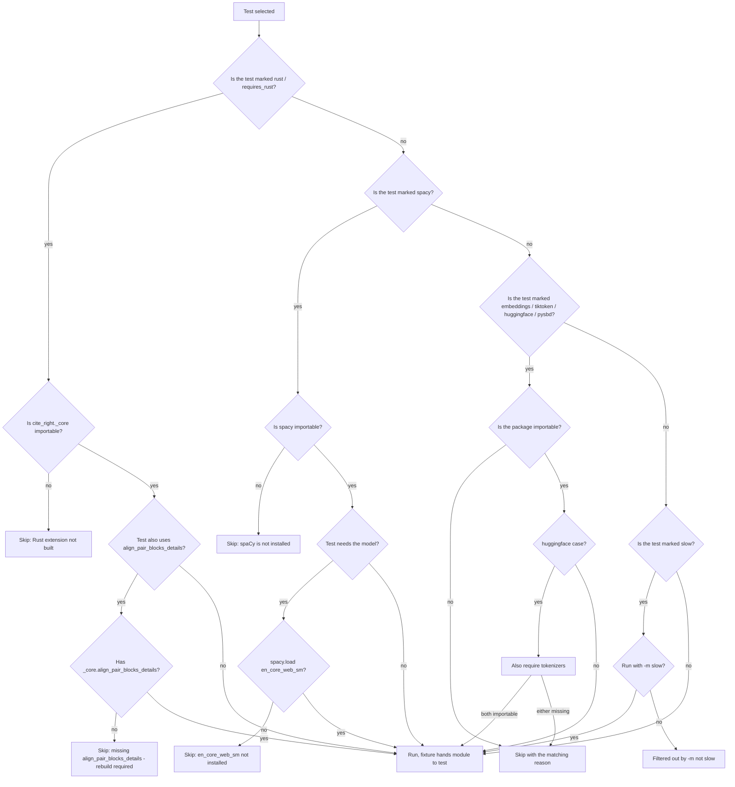

# Pytest Markers and Optional Dependencies

`tests/conftest.py` is the single source of truth for the optional-dependency test gates in this repo. It registers seven pytest markers, defines availability probes for the Rust extension and for the optional `[spacy]`, `[embeddings]`, `[tiktoken]`, `[huggingface]`, and `[pysbd]` extras, and exposes fixtures and skip decorators that other test files import to gate their tests cleanly. The same conftest also defines `basic_citation_config`, `multi_span_config`, `paper_scenario_config`, and the DSPy paper-scenario source strings reused across the test suite, but this page covers only the marker / fixture / skip surface.

A test that touches the Rust extension must skip cleanly when `cite_right._core` is not importable, and the same test must additionally skip when the extension is too old to expose the `*_details` entry points needed by `multi_span_evidence`. A test that touches spaCy must skip when the package is missing and also when the `en_core_web_sm` model is missing. Skip messages are concrete, so a missing optional dependency is reported as the reason for the skip rather than as a failure.

## Marker Registration

`pytest_configure` in `tests/conftest.py` registers the seven markers with `config.addinivalue_line("markers", ...)`:

| Marker | Triggered by | Reason string on skip |
| --- | --- | --- |
| `rust` | Optional Rust extension `cite_right._core` not built | `"Rust extension not built"` |
| `spacy` | `spacy` package and `en_core_web_sm` model not installed | `"spaCy model en_core_web_sm not installed"` |
| `embeddings` | `sentence-transformers` not installed | `"sentence-transformers is not installed"` |
| `tiktoken` | `tiktoken` not installed | `"tiktoken is not installed"` |
| `huggingface` | `transformers` and `tokenizers` both not installed | `"transformers/tokenizers not installed"` |
| `pysbd` | `pysbd` not installed | `"pysbd is not installed"` |
| `slow` | Tests that take noticeably longer than the rest of the suite | (no auto-skip; runs unconditionally unless `-m 'not slow'` is passed) |

The seven lines are the only place these markers are declared. `pyproject.toml` notes "Markers are registered in conftest.py via `pytest_configure`" rather than re-declaring them, so a CI run that runs `pytest` against the conftest sees the full set and a `pytest --strict-markers` run does not flag them as unknown.

`rust` and `spacy` are the two markers that gate tests on the largest surfaces. `rust` gates the Smith-Waterman parity tests, the inverted-index tests, the Rust prepare tests, and the multi-span evidence tests. `spacy` gates `SpacySegmenter` and `SpacyAnswerSegmenter` tests as well as the `SpacyClaimDecomposer` tests in `tests/test_citations_spacy.py` and `tests/test_segmenter.py`.

The `slow` marker is a soft gate. It is registered so `-m 'not slow'` can drop slow tests from a quick run and so `-m slow` can target them in a long run, but it does not run an availability check and does not skip by itself.

## Rust Extension Fixtures

Two fixtures hand the imported `cite_right._core` module to a test, skipping the same way the matching `requires_rust` / `requires_rust_blocks` decorators do.

`rust_core` returns the `cite_right._core` module object when it imports, and calls `pytest.skip("Rust extension not built")` on `ImportError`. Tests that call the entry points exposed by every version of the extension (`align_pair`, `align_pair_details`, `align_best`, `align_best_details`, `align_batch_details`, `align_topk_details`, `rust_tokenize_and_prepare`, `InvertedIndex`, `PreparedCorpus`, `align_batch_with_match_blocks`, `align_pair_blocks_details`) take the `rust_core` fixture.

`rust_core_with_blocks` additionally requires `hasattr(_core, "align_pair_blocks_details")`. When the module is importable but the `align_pair_blocks_details` symbol is missing, the fixture calls `pytest.skip("Rust extension is missing align_pair_blocks_details (rebuild required)")`. The capability check is the contract-level test for "is this extension new enough to drive the `multi_span_evidence` path?".

The capability check is needed because `align_pair_blocks_details` was added in 0.4.0 and older abi3 wheels in the field do not export it. A user who installs `cite-right` from a pre-0.4.0 wheel gets a build that imports cleanly but lacks the `*_blocks_details` entry points; without the `rust_core_with_blocks` gate, those tests would `AttributeError` instead of skipping. The same check runs at `RustSmithWatermanAligner` construction time and raises `RuntimeError` with a rebuild message if the entry point is missing, so a test that constructs the aligner sees a hard fail and a test that takes the fixture sees a clean skip. Both paths agree on what "new enough" means.

## Rust Skip Decorators

Two `pytest.mark.skipif` decorators import the same probes and emit the same reason strings as the matching fixtures, so a test that picks the decorator and a test that picks the fixture skip identically:

- `requires_rust` — `pytest.mark.skipif(not _rust_available(), reason="Rust extension not built")`. Apply to any test that calls into `cite_right._core`.
- `requires_rust_blocks` — `pytest.mark.skipif(not _rust_has_blocks_details(), reason="Rust extension missing align_pair_blocks_details")`. Apply to any test that calls `align_pair_blocks_details`, `align_batch_blocks_details`, or the `RustSmithWatermanAligner(return_match_blocks=True)` wrapper.

`requires_rust` is the higher-traffic decorator. It is used by `tests/test_alignment_rust_parity.py`, `tests/test_inverted_index.py`, `tests/test_rust_prepare_with_embeddings.py`, `tests/test_paraphrase_support.py`, and `tests/test_citations_api.py`. The shape of a `@requires_rust` test is the same in every file: import the conftest decorator, decorate the test function, take the `rust_core` fixture, and call the entry point directly.

`requires_rust_blocks` is narrower. It is used by the multi-span evidence tests in `tests/test_alignment_rust_parity.py` (the equal-score coverage regression, the blocks-vs-non-blocks traceback identity test, the wrapper batch ordered-results test) and by `tests/test_citations_multi_span.py`. Those tests need `align_pair_blocks_details` and `align_batch_blocks_details` to populate `match_blocks` and `evidence_spans`. A test that takes `rust_core_with_blocks` and a test that is decorated with `requires_rust_blocks` skip under the same condition and the same message.

`requires_rust_blocks` is intentionally strict: a build that has `align_pair_details` but not `align_pair_blocks_details` still skips, because the multi-span path cannot run. The capability check is `hasattr(_core, "align_pair_blocks_details")`; that is the same probe `RustSmithWatermanAligner(return_match_blocks=True)` runs at construction time.

## Optional-Dependency Skip Decorators

The remaining skip decorators do not have a paired fixture, but they are the canonical gate for tests in their domain.

- `requires_spacy` — skips if `spacy` is not importable. Reason: `"spaCy is not installed"`. Use this for tests that touch spaCy constructors but not a particular model.
- `requires_spacy_model` — skips if `spacy` is importable but `spacy.load("en_core_web_sm")` raises `OSError`. Reason: `"spaCy model en_core_web_sm not installed"`. Use this for tests that call the parser end to end.
- `requires_embeddings` — skips if `sentence_transformers` is not importable. Reason: `"sentence-transformers is not installed"`.
- `requires_tiktoken` — skips if `tiktoken` is not importable. Reason: `"tiktoken is not installed"`.
- `requires_huggingface` — skips unless both `transformers` and `tokenizers` are importable. Reason: `"transformers/tokenizers not installed"`.
- `requires_pysbd` — skips if `pysbd` is not importable. Reason: `"pysbd is not installed"`.

The probes are `importlib.util.find_spec(...)` calls, not import attempts, so a missing optional dependency does not raise during probe evaluation. `requires_spacy_model` runs `spacy.load("en_core_web_sm")` inside a `try`/`except OSError` because the model is a separate download from the `spacy` package; `pip install "cite-right[spacy]"` installs the package but the model still needs `python -m spacy download en_core_web_sm`.

Some test files do not use these decorators and instead call `pytest.importorskip("tiktoken")` / `pytest.importorskip("transformers")` at the top of the file (for example `tests/test_tokenizer_tiktoken.py` and `tests/test_tokenizer_huggingface.py`). That is the same idea, applied per module rather than per test. The module-level `importorskip` is the right choice when every test in the file needs the dependency, and the conftest decorator is the right choice when only some tests in the file do.

`tests/test_citations_embeddings.py` and the embeddings class in `tests/test_multilingual_content.py` add an extra gate on top of the package: they read the `CITE_RIGHT_RUN_EMBEDDINGS_TESTS` environment variable and require it to be `"1"`. The reason string is `"Set CITE_RIGHT_RUN_EMBEDDINGS_TESTS=1 to run embeddings tests"`. The tests still need `sentence-transformers` and a downloadable model, so the env-var gate is an opt-in on top of the package-level availability check.

## Decision Flow

A test reaches the run step only when every gate it has asked for is satisfied. The skip messages are concrete enough that a missing dependency shows up in `pytest -v` as `SKIPPED [<reason>]` rather than as a stack trace, which is the right behavior for a library that is published with optional features.

## How The Fixtures And Decorators Interact

`rust_core` and `rust_core_with_blocks` are the only fixtures exported by `tests/conftest.py` for the marker surface. The optional-dependency fixtures (`spacy_nlp`) are separate.

- A test decorated with `@requires_rust` and taking the `rust_core` fixture skips with `"Rust extension not built"` if `_core` is missing and runs otherwise.
- A test decorated with `@requires_rust_blocks` and taking the `rust_core_with_blocks` fixture skips with the same message if `_core` is missing, and additionally skips with `"Rust extension is missing align_pair_blocks_details (rebuild required)"` if the module imports but the entry point is absent.
- A test that takes the `rust_core` fixture but is not decorated with `@requires_rust` still skips on `ImportError`; the skip happens inside the fixture body rather than at decoration time, but the result is the same.
- A test that is decorated with `@requires_rust` but does not take the fixture still skips; the test body is responsible for its own import, and the conftest's probe has already done the work to decide whether to skip.

A test that needs `align_pair_blocks_details` and takes `rust_core` instead of `rust_core_with_blocks` would skip when the extension is missing but `AttributeError` when the extension is too old. The convention in the repo is to use the matching fixture: `requires_rust` with `rust_core`, `requires_rust_blocks` with `rust_core_with_blocks`. That pairing is what keeps the skip message honest.

`spacy_nlp` is a separate fixture in the same conftest. It calls `pytest.importorskip("spacy")` and then tries `spacy.load("en_core_web_sm")`, skipping with `"spaCy model en_core_web_sm not installed"` on `OSError`. The model fixture is paired with `requires_spacy_model` rather than `requires_spacy` because the model availability is the test-relevant check, not just the package.

## Pointers

- `tests/conftest.py` — marker registration, `requires_rust` / `requires_rust_blocks` / `requires_spacy` / `requires_spacy_model` / `requires_embeddings` / `requires_tiktoken` / `requires_huggingface` / `requires_pysbd`, the `_rust_available` / `_rust_has_blocks_details` / `_spacy_available` / `_spacy_model_available` / `_embeddings_available` / `_tiktoken_available` / `_huggingface_available` / `_pysbd_available` probes, and the `rust_core` / `rust_core_with_blocks` / `spacy_nlp` fixtures.
- `tests/test_alignment_rust_parity.py` — primary consumer of `requires_rust` and `requires_rust_blocks`.
- `tests/test_inverted_index.py`, `tests/test_rust_prepare_with_embeddings.py`, `tests/test_paraphrase_support.py`, `tests/test_citations_api.py` — additional `requires_rust` consumers.
- `tests/test_citations_multi_span.py` — `requires_rust_blocks` consumer that exercises the `multi_span_evidence` path through `align_pair_blocks_details`.
- `tests/test_citations_spacy.py`, `tests/test_segmenter.py` — `requires_spacy_model` consumers.
- `tests/test_tokenizer_tiktoken.py`, `tests/test_tokenizer_huggingface.py` — module-level `pytest.importorskip` rather than the conftest decorators.
- `tests/test_citations_embeddings.py`, `tests/test_multilingual_content.py` — `CITE_RIGHT_RUN_EMBEDDINGS_TESTS=1` opt-in on top of the `sentence-transformers` package check.
- `pyproject.toml` — `[project.optional-dependencies]` for `spacy`, `embeddings`, `tiktoken`, `huggingface`, `pysbd`, `langchain`, `llamaindex`; `[tool.pytest.ini_options]` notes the markers are registered in conftest rather than re-declared.
- `src/cite_right/__init__.py` — the public surface for `SpacySegmenter`, `SpacyAnswerSegmenter`, `PySBDSegmenter`, `HuggingFaceTokenizer`, `TiktokenTokenizer`, `SentenceTransformerEmbedder`, and the rest of the optional classes gated by the markers.
- `src/cite_right/citations.py` — the pipeline that the optional dependencies feed into.
- `src/cite_right/core/prepared_corpus.py` — prepare, including the Rust prepare path that runs on the simple tokenizer / simple segmenter combination.
- `src/cite_right/contradiction.py` — the cheap contradiction check that runs after Smith-Waterman and can flip a citation to `"partial"`.
- `rust_core/` — the Rust extension source. `Cargo.toml` and the `lib.rs` entry points that define what `align_pair_blocks_details` is and which other symbols the extension must expose.
- `src/cite_right/core/aligner_rust.py` — `RustSmithWatermanAligner`, which performs the same `hasattr` capability check on `align_pair_blocks_details` and `align_batch_blocks_details` that `rust_core_with_blocks` performs, and raises `RuntimeError` with a rebuild message on mismatch.
- `openwiki/advanced/rust-acceleration.md` — the public-facing Rust extension guide, including the `backend="auto" | "python" | "rust"` switch and the fallback when `_core` is missing.
- `openwiki/testing/contract-tests.md` — the parity contract enforced by `tests/test_alignment_rust_parity.py`, including the tie-breaker and the `align_pair_blocks_details` shape.
