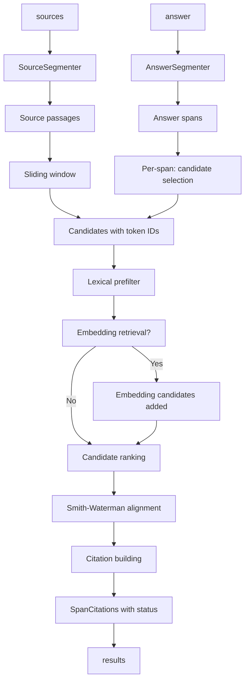

## Overview

`align_citations` is the primary entry point for character-accurate citation extraction. Given a generated answer and a list of source documents, it returns one `SpanCitations` per answer segment, each containing the answer span text, ranked citations with absolute character offsets into the original sources, and an overall status (`supported`, `partial`, or `unsupported`).

This document covers the complete function signature, the internal pipeline phases, how to interpret the return value, and how optional components (tokenizers, segmenters, embedder, metrics callback) affect behavior.

## Function signature

```python
def align_citations(
    answer: str,
    sources: Sequence[str | SourceDocument | SourceChunk],
    *,
    config: CitationConfig | None = None,
    backend: Literal["auto", "python", "rust"] = "auto",
    answer_segmenter: AnswerSegmenter | None = None,
    source_segmenter: Segmenter | None = None,
    tokenizer: Tokenizer | None = None,
    aligner: Aligner | None = None,
    embedder: Embedder | None = None,
    on_metrics: MetricsCallback | None = None,
) -> list[SpanCitations]
```

### Positional arguments

| Argument | Type | Description |
|---|---|---|
| `answer` | `str` | The generated text to find citations for. |
| `sources` | `Sequence[str \| SourceDocument \| SourceChunk]` | Source documents or text strings. Accepts plain strings (uses index as `source_id`), `SourceDocument(id, text)`, or `SourceChunk` with precomputed chunk offsets. |

### Keyword-only arguments

| Argument | Default | Description |
|---|---|---|
| `config` | `None` | `CitationConfig` instance controlling thresholds, weights, and candidate limits. `None` uses `CitationConfig()`. |
| `backend` | `"auto"` | Alignment backend: `"auto"` uses Rust if available, `"python"` forces pure Python, `"rust"` requires Rust (raises if missing). |
| `answer_segmenter` | `None` | `AnswerSegmenter` to split the answer into spans. Default is `SimpleAnswerSegmenter` (sentence-splitting). |
| `source_segmenter` | `None` | `Segmenter` to split source documents into sentences for windowing. Default is `SimpleSegmenter`. |
| `tokenizer` | `None` | `Tokenizer` for text → token-id conversion with character-span tracking. Default is `SimpleTokenizer`. |
| `aligner` | `None` | `Aligner` for local sequence alignment. Default is `SmithWatermanAligner` (or Rust equivalent). |
| `embedder` | `None` | `Embedder` for semantic similarity retrieval. When provided, pulls semantically similar passages into the candidate set before alignment. |
| `on_metrics` | `None` | `MetricsCallback` receiving `AlignmentMetrics` (total time, span count, candidate count, alignment count, timing breakdowns). |

## Pipeline phases



### Phase 1 — Source preparation (`PreparedCitationCorpus.from_sources`)

Sources are normalized into `NormalizedSource` objects, then windowed into overlapping passage candidates using the configured `window_size_sentences` and `window_stride_sentences`. Each candidate is tokenized and indexed.

**Rust fast path**: When `backend="auto"` or `"rust"`, `SimpleTokenizer`, and `SimpleSegmenter` are in use, tokenization and candidate generation run in Rust via `rust_tokenize_and_prepare`. Python falls back when the Rust extension is absent or when custom tokenizers/segmenters are supplied.

### Phase 2 — Answer segmentation

The answer string is split into `AnswerSpan` objects by the `AnswerSegmenter`. The default `SimpleAnswerSegmenter` splits on sentence boundaries. Each span carries `char_start`/`char_end` pointing into the full answer string.

### Phase 3 — Candidate selection

For each answer span:

1. **Lexical prefilter**: IDF-weighted token overlap scores candidate relevance using an inverted index (Rust) or Python-side set intersection.
2. **Embedding expansion** (if `embedder` provided): Top-k semantically similar passages are added as candidates, even if they lack lexical overlap.
3. **Ranking**: Candidates are ranked by `max(embedding_score, lexical_score)`, then capped at `max_candidates_total`.

Candidate selection respects `max_candidates_lexical`, `max_candidates_embedding`, and `max_candidates_total`.

### Phase 4 — Smith-Waterman alignment

Each selected candidate runs local alignment (Smith-Waterman) against the answer span's tokens. The aligner scores match/mismatch/gap and returns a best-scoring substring region.

**Rust fast path**: When `RustSmithWatermanAligner` is in use, `rust_corpus.build_citations` runs alignment entirely in Rust for lower marshalling overhead. Falls back to Python on error.

### Phase 5 — Citation building

For each alignment:

1. Compute metrics: `answer_coverage`, `evidence_coverage`, `normalized_alignment`.
2. Compute final weighted score using `CitationWeights`.
3. Apply thresholds: `min_alignment_score`, `min_answer_coverage`, `min_final_score`.
4. If all pass → build `Citation` with character offsets from token spans.
5. If alignment failed but retrieval scores exist → build `RetrievalSupport` entry.

**Structured-field retry**: When a source looks like flattened `field:value` lines (e.g. data2txt output), a second alignment pass runs with `gap_score=0` to handle reordered field rewrites.

### Phase 6 — Ranking and deduplication

Citations are sorted by score, then deduplicated by `(source_id, span_key)` where `span_key` is the tuple of `(char_start, char_end)` from evidence spans. Per-source citation count is capped at `max_citations_per_source`. Total output is capped at `top_k`.

## Return value: `list[SpanCitations]`

```python
class SpanCitations(BaseModel):
    answer_span: AnswerSpan          # Which answer segment this corresponds to
    citations: list[Citation]        # Ranked exact citations (may be empty)
    retrieval_support: list[RetrievalSupport]  # Retrieval-only hints
    status: Literal["supported", "partial", "unsupported"]
```

### `SpanCitations.status` decision

| Status | Condition |
|---|---|
| `supported` | `citations` is non-empty **and** `best.citation.components["answer_coverage"] >= config.supported_answer_coverage` (default 0.6) |
| `partial` | `citations` exists but coverage is below threshold, **or** a contradiction was detected between the answer span and evidence passage |
| `unsupported` | `citations` is empty (no alignment met minimum thresholds) |

**Important**: `retrieval_support` does not influence status. A high embedding score that did not localize via Smith-Waterman is not a `Citation` and cannot make a span `supported`.

### `Citation` structure

```python
class Citation(BaseModel):
    score: float                      # Weighted final score
    source_id: str                    # From SourceDocument.id or SourceChunk.source_id
    source_index: int                 # Position in input sources list
    candidate_index: int              # Internal candidate index
    char_start: int                   # Half-open start offset in source
    char_end: int                     # Half-open end offset in source
    evidence: str                     # Legacy contiguous evidence text
    evidence_spans: list[EvidenceSpan] # Non-contiguous spans (multi-span mode)
    components: Mapping[str, float]   # Score component breakdown
```

**Character offsets** satisfy: `source_text[citation.char_start:citation.char_end] == citation.evidence`.

**Deduplication**: `_rank_and_limit_citations` deduplicates by `(source_id, span_key)` where `span_key = tuple((span.char_start, span.char_end) for span in evidence_spans)`. Only one citation per unique source+span region survives.

**`max_citations_per_source`**: After deduplication, at most `config.max_citations_per_source` (default 2) citations are kept per `source_id` before the global `top_k` cap.

## Convenience output

The quickstart pattern from the README demonstrates typical result inspection:

```python
results = align_citations(
    answer,
    sources,
    config=CitationConfig(top_k=1),
    embedder=SentenceTransformerEmbedder("all-MiniLM-L6-v2"),
    tokenizer=TiktokenTokenizer(),
)
for result in results:
    print(result.answer_span.text, result.status)
    for citation in result.citations:
        source_doc = sources[citation.source_index]
        evidence = source_doc.text[citation.char_start:citation.char_end]
        print(" ", citation.source_id, evidence)
```

This prints every answer span, its status, and for each citation the source ID and the exact evidence substring (which matches the character offsets in the citation).

## Embedder role

Providing an `embedder` (e.g., `SentenceTransformerEmbedder`) changes candidate selection:

- Embeddings improve **recall** for paraphrased content where token overlap is low.
- The embedder pulls semantically similar passages into the candidate set even if they lack shared tokens.
- These candidates still require Smith-Waterman localization to become `Citation` objects.
- High-similarity passages that do not localize become `RetrievalSupport`, not citations.

Without an embedder, candidate selection relies solely on lexical (IDF-weighted) overlap, which may miss paraphrased answers.

## Metrics callback

The `on_metrics` callback receives an `AlignmentMetrics` object after `align_citations` completes:

```python
@dataclass(frozen=True)
class AlignmentMetrics(BaseModel):
    total_time_ms: float
    num_answer_spans: int
    num_candidates: int
    num_alignments: int
    embedding_time_ms: float = 0.0
    alignment_time_ms: float = 0.0
```

Timing fields (`embedding_time_ms`, `alignment_time_ms`) include the full pipeline: source embedding index build time is in `corpus.embedding_build_time_ms` on the returned `PreparedCitationCorpus`, while span-level embedding and alignment are reported per-span in the metrics callback.

## See also

- [CitationConfig and weights](/openwiki/operations/citation-config.md) — threshold fields, scoring weights, and named presets
- [Citation status semantics](/openwiki/concepts/status-semantics.md) — detailed status derivation rules
- [High-precision tuning](/openwiki/workflows/high-precision-tuning.md) — guidance for adversarial inputs
